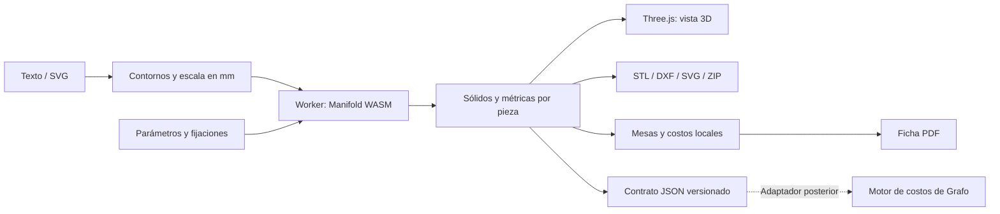

# Grafo3D by Grafoprint

Aplicación independiente para diseñar y fabricar letras corpóreas, banderolas circulares y encastres esféricos. Antes denominada Forma Studio; conserva el paquete `forma-studio` y los formatos de proyecto existentes por compatibilidad. Implementación propia basada en el relevamiento funcional de LetraMaker, sin reutilizar su código ni sus recursos gráficos. La identidad visual usa el logo de Grafo3D suministrado por el usuario; ver `docs/identidad-visual.md`.

## Arranque

Desde la raíz de Grafo:

```sh
npm --prefix apps/forma-studio ci
npm --prefix apps/forma-studio run dev
```

Abrir **http://127.0.0.1:3010**. Requiere Node compatible con Vite 8 (22.12 o posterior) y un navegador con WebGL y WebAssembly. No necesita que Grafo, su API o su base de datos estén funcionando.

```sh
npm --prefix apps/forma-studio test
npm --prefix apps/forma-studio run build
```

El resultado de producción está en `dist/`. Se puede servir en un dominio propio con HTTPS y el MIME `application/wasm` para el motor. Las fuentes están incluidas; no se consulta a Google Fonts durante el uso. `npm run preview` sirve el compilado en el puerto 3010 si el servidor de desarrollo está detenido.

## Funciones implementadas

- Texto con 16 fuentes locales, altura y espaciado en milímetros. SVG con curvas, huecos y transformaciones; se conserva la escala del dibujo incluso cuando el documento tiene márgenes.
- Doce construcciones paramétricas contrastadas con el acceso Maker: fondo impreso, fondo abierto, apoyo doble, apoyo único, encastre trasero, retroiluminación simple/doble, acrílico encastrable, frente impreso, iluminación doble, letra curva, canal neón y Organic.
- Controles específicos por modelo: paredes, apoyos triangulares o planos, bordes, retrocesos, holguras, pestaña exterior, tapas desmontables, bandeja con retención, neón pleno/contorno y barrido angular con base unida o encastrable. Los parámetros se conservan al cambiar de estilo.
- Editor por componentes en Acrílico encastrable y Frente impreso: cuerpo, base desmontable, acrílico y encastre; altura directa de base, aislamiento en el visor y esquema de montaje, conservando los proyectos anteriores.
- Seis variantes adicionales de base en Acrílico encastrable y Frente impreso: interior, al ras, reborde exterior, marco con PVC independiente, doble canal y PVC con tope trapezoidal. Este último admite exterior recto, biselado, curvo o angular, conservando el paso interior de las placas. Selección en Parámetros → Construcción de la base.
- Frente calado con difusor acrílico interno y las seis bases nuevas: círculos, diamantes, cuadrados, hexágonos, oblongos y triángulos; tamaño, separación, borde protegido y rotaciones independientes. Calado real en el STL y difusor entero en DXF/SVG. Es la construcción número 13; ver `docs/frente-calado.md`.
- Siete perfiles Organic: zigzag, barriga, pedestal/S, ondas, bumper, bubble y frisos. Frente acrílico o impreso, sólido o cascarón, fijación frontal o trasera, fondo impreso/PVC y sección del perfil visible.
- Visor 3D con órbita, zoom, vistas, cuadrícula, colores, visibilidad y despiece. Precisión de profundidad ajustada al zoom y trece miniaturas de cortes 3D generadas con geometría propia.
- Perforaciones circulares y oblongas, pines con agujero ciego, arrastre de posiciones y coordenadas numéricas; eliminación y deshacer/rehacer.
- Cortes X/Y con separación. Cada sección se cierra como sólido y puede exportarse individualmente.
- Diseñador de encastre esférico: perno, esfera, cuello, base, alojamiento, ranuras, alivios, tornillos, ángulo de impresión, vistas separada/montada/sección, masa por pieza, importación/exportación JSON.
- Banderola circular de doble cara: cuerpo y aros enteros por defecto (división opcional), aros envolventes con cierre click o tornillos laterales, dos acrílicos y gráficas independientes, siete perfiles orgánicos opcionales en el lateral entre los aros, interior libre para definir la iluminación, brazo central Recto, Curvo o Clásico con tornillos desde el interior e insertos ciegos, sección y despiece. Pilotos ciegos, juntas flexibles opcionales y archivos por componente. Es un prototipo pendiente de ensayo físico; ver `docs/banderola-estado.md`.
- Distribución automática en mesas configurables con rotación de 90°, separación, aviso de piezas grandes y STL/DXF por mesa.
- Exportación STL binaria, DXF, SVG, proyecto JSON, paquete ZIP y contrato de integración con Grafo. Selección por capa o pieza.
- Materiales y tarifas independientes para filamento, acrílico y PVC; estimación de masa, horas, costo y precio. Plantillas DXF de base LED. PDF con datos del taller, logo, detalle por componente, checklist y numeración.
- Guardado automático, biblioteca local de proyectos, predefiniciones e historial de fichas. Modo claro/oscuro y panel de diseño plegable.

## Estado y alcance

Es una **versión funcional local del editor y la fabricación**, no un servicio comercial publicado. Los proyectos se guardan en el navegador; borrar esos datos los elimina. El JSON permite conservar una copia y trasladarla a otro equipo. El historial conserva el proyecto, y al reabrirlo se vuelve a calcular con el motor actual.

Las doce familias se reconstruyeron con geometría propia después de inspeccionar el acceso Maker: controles, variantes, despiece y archivos STL/DXF descargados desde la interfaz. Se contrastaron cotas y secciones de muestras equivalentes, incluidas las siete variantes Organic. El detalle está en `docs/modelos-letramaker-premium.md`. No se certifica igualdad para todas las combinaciones posibles de parámetros ni el ajuste físico sin imprimir una muestra. Los perfiles cuyo offset cierra o divide huecos pueden requerir aumentar el tamaño del diseño o reducir el relieve. La tarjeta adicional Vazado Paramétrico quedó relevada fuera de estas doce familias y no está implementada.

La distribución usa rectángulos envolventes; no realiza nesting irregular ni permite alojar una pieza dentro del hueco de otra. Los cortes son planos, sin dientes de unión automáticos. La sección del encastre es una vista de inspección; los archivos de fabricación conservan el sólido completo.

Las tarifas iniciales son ejemplos y deben reemplazarse por las del taller. Los consumos parten del volumen del sólido, la densidad y la merma. Las horas usan un caudal configurable. **No hay laminado ni generación de G-code**; relleno, soportes, velocidad y orientación deben verificarse en el laminador. La flexión del encastre es orientativa y requiere validar una muestra física. Algunas fuentes con tablas GSUB no soportadas usan contornos individuales con kerning; no se promete composición tipográfica de todos los idiomas.

Faltan cuentas en la nube, aislamiento por organización, sincronización, suscripciones/licencias y facturación para operar como SaaS. El modelo de venta se dejó consultado al usuario. Tampoco hay una llamada activa a la API de Grafo: el contrato de integración está listo para implementar el adaptador autenticado descrito en `docs/integracion-grafo.md`.

## Arquitectura



`src/core/engine.ts` coordina el motor sin React; `letter-models.ts` construye paredes, frentes y tapas, y `profile-sweep.ts` genera barridos de contornos con huecos. El worker se termina al cambiar la entrada; los resultados antiguos no reemplazan el diseño actual. Las operaciones pesadas tienen un límite de 45 segundos. Los objetos WASM se liberan al terminar cada cálculo.

`src/core/source.ts` interpreta SVG y OpenType. `src/core/output.ts` produce archivos y métricas. `src/core/storage.ts` valida proyectos y almacena datos locales. `src/components/` contiene el editor, el visor y producción. Este paquete tiene sus propias dependencias y compilación; no importa módulos de Grafo.

## Validación

390 pruebas automatizadas: alojamientos prismáticos y apoyo continuo del acrílico, recorridos completos de las placas, sólidos cerrados de las 13 construcciones, seis patrones de frente calado y protección de bordes, cotas y áreas de sección medidas en la referencia, siete perfiles Organic y combinaciones de frente/fondo, tapas y encastres sin interferencias, conservación de volumen al cortar, perforaciones, exportación STL sin caras de área cero, costos y DXF de PVC, plantillas LED, mesas sin superposición, parámetros inválidos, escala SVG, agujeros, 16 fuentes, persistencia, normales de aristas/curvas, encuadre de sombras y cuadrícula centrada y dimensionada según los límites del modelo, incluso con coordenadas desplazadas o carteles de varios metros.

La auditoría de fabricación incluye 79 configuraciones, reimportación de STL individuales y rotados en mesa, continuidad de apoyos, ausencia de membranas y recorridos de montaje. El visor muestra el frente del cartel hacia arriba; el paquete de fabricación conserva la orientación de impresión de cada pieza. Detalle y límites en `docs/auditoria-fabricacion-modelos.md`.

Los controles numéricos permiten borrar y escribir libremente, con coma o punto decimal. Aplican las medidas válidas automáticamente tras 400 ms sin escribir, conservando el texto y el cursor. Enter o salir del campo adelanta la aplicación; Escape cancela lo pendiente. Las 18 pruebas de edición montan el control real en un DOM y verifican debounce, cancelación, valores intermedios, validación de límites, decimales, flechas y sincronización externa.

Al regenerar la geometría se conservan posición, rotación, zoom y objetivo de la cámara. Sólo se encuadra automáticamente la primera geometría del proyecto/modo; los botones de encuadre y de vista siguen disponibles. Cinco pruebas montan el visor con cámara y OrbitControls reales (sin GPU) para verificar estas transiciones y la orientación del montaje. En el navegador se comprobó una altura aplicada sin Enter ni salir del campo, conservando una vista girada y alejada.

También se probó en Chrome la compilación de producción: regeneración de texto/altura, edición X/Y de un agujero, corte de una letra en cuatro componentes, cambio entre letras y encastres, vistas de montaje, descargas y restauración tras recargar. La ficha PDF se renderizó y revisó visualmente. Los archivos STL descargados se inspeccionaron para verificar triángulos, aristas y escala.

## Documentos

- `docs/auditoria-fabricacion-modelos.md`: correcciones de geometría, orientación, recorridos y validación de los STL exportados.
- `docs/bases-y-cierre-pvc.md`: variantes de bases, cierre trapezoidal, perfiles, montaje y contrato de fabricación versión 2.
- `docs/frente-calado.md`: seis patrones, difusor acrílico, parámetros, límites y validación de la nueva construcción.
- `docs/editor-por-componentes.md`: primera etapa implementada, alcance, compatibilidad y verificación de las letras encastrables.
- `docs/relevamiento-proled.md`: catálogo de 27 estructuras, parámetros por componente, herramientas y comparación con Grafo3D; investigación previa a implementación, con muestras y mediciones propias.
- `docs/miniaturas-y-visor.md`: regeneración de las miniaturas y corrección de precisión al alejar la cámara.
- `docs/modelos-letramaker-premium.md`: auditoría Maker de las doce familias, parámetros y comparación geométrica.
- `docs/relevamiento-letramaker.md`: relevamiento histórico inicial con acceso Explorer.
- `docs/integracion-grafo.md`: contrato, unidades y adaptación al motor existente.
- `docs/matriz-funcional.md`: correspondencia y diferencias respecto del relevamiento.
- `THIRD_PARTY_NOTICES.md` y `public/fonts/`: dependencias y licencias tipográficas.
