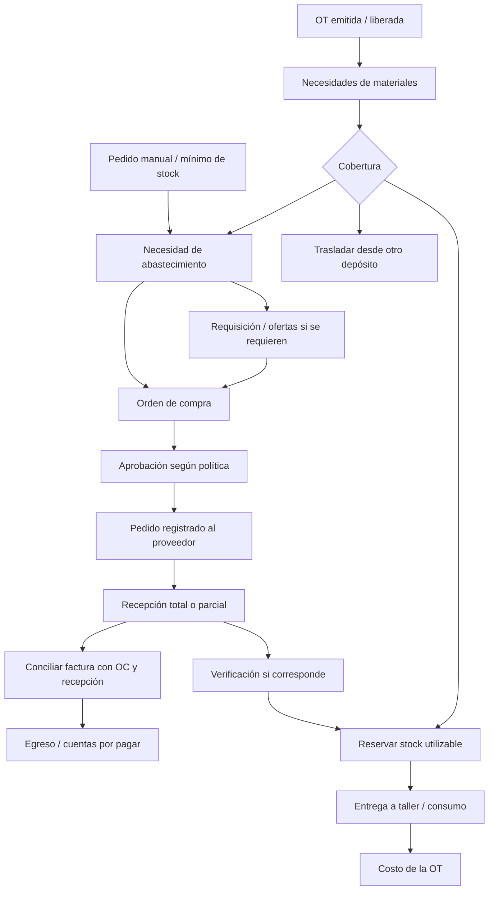

# Compras, reservas y abastecimiento de Grafo

**Fecha:** 19/09/2026. **Estado:** Base, C0 y C1 implementados en `codex/inventario-base-coherente`. Primer circuito de C2 (proveedores, reposición, compras y recepciones aceptadas) implementado. Reserva automática al emitir e incorporación automática de necesidades implementadas (§11.5). C2 ampliado y promesa de entrega aún pendientes; ver §11.4.

**Base revisada:** `main`, `c874b852b`. Alcance: SaaS para gráficas pequeñas, medianas e industriales. No se toma la operación de un único tenant como regla del producto.

## 1. Decisión de producto

Priorizar este módulo antes de la preparación comercial propuesta en el relevamiento de competidores. Completar el circuito **necesidad → cobertura → compra → recepción → consumo → costo**. La venta, los precios y la activación comercial quedan para una etapa posterior.

La aclaración del usuario es un requisito: **la forma de comprar debe ser configurable**. Una empresa puede registrar una compra ya realizada, otra centralizar faltantes y otra exigir requisición, comparación de ofertas, aprobación y control de recepción. Deben compartir las mismas entidades, trazabilidad y cálculos, aunque vean distintas acciones.

El diseño desarrolla las fases **F9 y F10** del [plan maestro](visual-ilusion-plan-maestro.md#fase-9--inventario-comprometido-reservas-y-trazabilidad). El cierre económico integral también depende de tiempos, cantidades buenas y reprocesos de producción: compras aporta su parte, sin declarar terminadas esas otras fases.

### Resultado esperado

- Comercial sabe si el trabajo requiere material aún no disponible.
- Producción sabe qué puede comenzar y qué dependencia falta.
- Compras ve qué adquirir, para cuándo y a qué órdenes afecta.
- Depósito registra lo efectivamente recibido, entregado a taller y devuelto.
- Administración relaciona lo pedido, recibido, facturado y pagado.
- Dirección distingue costo previsto, comprometido y realizado.

## 2. Investigación: cómo lo resuelven otros sistemas

Se consultó documentación oficial funcional, además de páginas comerciales. Esto permite identificar comportamientos concretos, pero no constituye una prueba de sus productos ni confirma qué licencias incluyen cada función. Algunas páginas de PrintVis pertenecen a su sección Legacy; la reserva de ERPNext citada está identificada para v16. Las recomendaciones siguientes son diseño propuesto para Grafo.

### 2.1 PrintVis: requerimientos conectados con reservas y compras

La pantalla de requerimientos separa necesidad, reservado y cantidad pendiente en compras. Permite reservar desde ubicaciones concretas y utilizar reemplazos con factores. La recepción de una OC vinculada a un trabajo puede reservar automáticamente lo recibido según la política del artículo; el consumo reduce la reserva. [Reservas de PrintVis](https://learn.printvis.com/Legacy/Purchasing/ItemRes/).

Su asistente permite comprar desde el trabajo o enviar necesidades a una hoja central de aprovisionamiento. Agrupa líneas compatibles en pedidos abiertos al proveedor y calcula fechas a partir del plazo del material. Incluye bienes y servicios externos. [Purchase Guide](https://learn.printvis.com/Pages/pvspurchaseguide/).

La recepción tiene una interfaz específica para depósito que impide registrar accidentalmente una factura. [Registro de recepciones](https://learn.printvis.com/Legacy/Shipping/RegisterReceiptsinPrintVis/).

**Aplicación a Grafo:** compras descentralizadas o centralizadas con el mismo vínculo a la necesidad; recepción y facturación con responsabilidades independientes.

### 2.2 printIQ: faltantes consolidados y preparación de la producción

Las notas oficiales v49/v48 describen un tablero que reúne materiales de próximos trabajos y agrupa necesidades por material o proveedor. Un estado de inventario indica si el pedido puede producirse, necesita compra o ya fue preparado. También documentan opciones de preparación por depósito y FIFO. [Notas de versión, páginas 9–12 del PDF](https://printiq.com/wp-content/uploads/2025/08/printIQ-v49v48.2v48.1-Release-Notes.pdf).

**Aplicación a Grafo:** la pantalla principal debe responder «qué falta y qué trabajos afecta», con acceso al origen de cada cantidad. Evitar una lista de OC desconectada del taller.

### 2.3 Printer’s Plan: control gradual para talleres pequeños

Permite elegir qué materiales controlar, mínimos y cantidades por paquete. El circuito distingue comprobación/reserva, pedido, recepción y consumo. Al completar el trabajo puede solicitar la cantidad utilizada y actualizar su costo, conservando el precio de venta. [Herramienta de inventario](https://support.printreach.com/hc/en-us/articles/360059005953-Printer-s-Plan-Inventory-Tool).

**Aplicación a Grafo:** una empresa puede empezar con los materiales que más le importan y ampliar el control. El consumo declarado debe distinguirse del calculado automáticamente.

### 2.4 Midnight: catálogo del proveedor y costos externos

Las OC pueden vincularse a presupuestos y trabajos e incluir materiales, servicios y tercerizados. El catálogo de compra se relaciona con cada proveedor y puede precargar sus precios; se admiten descripciones libres. [Compras](https://support.printreach.com/hc/en-us/articles/360056077833-Purchasing), [artículos por proveedor](https://support.printreach.com/hc/en-us/articles/4410044499347-Adding-Warehouse-Items-to-Purchase-Orders).

**Aplicación a Grafo:** un proveedor preferido es una sugerencia. Necesitamos ofertas alternativas y líneas de servicio sin obligar a inventar materiales stockeables.

### 2.5 Odoo: estrategias de reposición y conciliación

Documenta reposición por mínimos/máximos, por pedido y por planificación; las sugerencias manuales permiten revisar y consolidar antes de comprar. [Estrategias de reposición](https://www.odoo.com/documentation/19.0/applications/inventory_and_mrp/inventory/warehouses_storage/replenishment.html).

Las reglas contemplan ubicación, proveedor y múltiplos; el horizonte y los plazos afectan cuándo pedir. [Reglas](https://www.odoo.com/documentation/19.0/applications/inventory_and_mrp/inventory/warehouses_storage/replenishment/reordering_rules.html), [panel de reposición](https://www.odoo.com/documentation/19.0/applications/inventory_and_mrp/inventory/warehouses_storage/replenishment/report.html).

La política de facturación puede basarse en lo pedido o recibido, y el cotejo OC–recepción–factura ayuda a detectar diferencias antes del pago. No debe confundirse un indicador de conciliación con una garantía absoluta de bloqueo financiero. [Políticas de control](https://www.odoo.com/documentation/19.0/applications/inventory_and_mrp/purchase/manage_deals/control_bills.html).

**Aplicación a Grafo:** reposición por OT y por stock mínimo son compatibles. El criterio de compra, la política de aprobación y la política de pago son decisiones diferentes.

### 2.6 ERPNext: demanda explícita y opcionalidad del trámite

La solicitud de materiales identifica cantidades, fecha y depósito; puede originarse en una lista de materiales, venta o plan productivo. Su documentación la considera opcional y útil para centralizar compras. [Material Request](https://docs.frappe.io/erpnext/material-request).

La OC puede reunir solicitudes asociadas al proveedor y manejar unidad de compra con conversión a stock. [Purchase Order](https://docs.frappe.io/erpnext/purchase-order).

La documentación de reservas del plan productivo, identificada para v16, diferencia stock existente de faltantes a comprar y vincula las recepciones con la necesidad original. [Reservas de producción](https://docs.frappe.io/erpnext/stock-reservation-for-production-plan).

**Aplicación a Grafo:** conservar una necesidad trazable aunque la empresa omita el formulario formal de requisición. Los controles adicionales no requieren cambiar la estructura de los datos.

### 2.7 Síntesis de la investigación

La propuesta que se desprende de estos ejemplos es combinar:

1. Necesidades de producción identificables y fechadas.
2. Existencias, reservas y compras pendientes como cantidades distintas.
3. Compras desde el trabajo y compras consolidadas.
4. Recepción y consumo como eventos físicos separados.
5. Opciones de control por material y empresa.
6. Vínculo económico con documentos del proveedor y costos de la OT.

No copiar automáticamente decisiones de otro sistema: por ejemplo, consumir siempre al cerrar todo el trabajo puede resultar insuficiente para una producción larga con entregas parciales.

## 3. Grafo: base verificada y extensiones necesarias

| Base existente | Evidencia | Qué aprovechar / completar |
|---|---|---|
| Variantes, tres unidades y proveedor de referencia | [Modelo](../apps/api/prisma/schema.prisma#L2431) | Mantener catálogo; agregar relaciones comerciales con varios proveedores. |
| Depósitos, ubicaciones, saldos y movimientos | [Modelos de stock](../apps/api/prisma/schema.prisma#L2520) | Reutilizar inventario; sumar reservas, estados utilizables y procedencia. |
| Costo promedio y conversiones por movimiento | [Servicio](../apps/api/src/inventario/inventario.service.ts#L909) | Usar una única escritura transaccional de stock para ingresos, consumos y transferencias. |
| Bloqueo concurrente por tenant/variante | [Movimiento](../apps/api/src/inventario/inventario.service.ts#L930) | Extender el mismo protocolo a reservas y recepción. |
| Cantidad real recibida en placas cuando se compra por peso | [Contrato de unidades](unidades-compra-stock-consumo-2026-09-17.md) | Guardar ambas cantidades; no inventar pesos universales ni cambiar el coeficiente del catálogo. |
| Snapshots de OT, componentes y lotes | [Ítem](../apps/api/prisma/schema.prisma#L3927), [snapshot productivo](../apps/api/src/produccion/snapshot-paso-produccion.ts) | Extraer demanda física del trabajo ejecutable, conservando revisión y procedencia. |
| Materiales separados de consumibles y desgaste | [MaterialEjecutado](../apps/api/src/motor-universal/tipos.ts#L1159) | No generar compras automáticas de toda línea de costo. |
| Material heredado no se vuelve a costear; merma aplicada una vez | [Motor](../apps/api/src/motor-universal/motor.service.ts#L6539) | Conservar estas reglas al extraer necesidades. |
| Tercerizados con estados y dependencias | [Servicio](../apps/api/src/ordenes-trabajo/ordenes-trabajo.service.ts#L7235), [panel actual](../src/components/comercial/panel-compras-ot.tsx) | Es una base de seguimiento; faltan OC, cantidades recibidas y costo real. |
| Egresos, pagos e imputaciones | [Modelo de obligación](../apps/api/prisma/schema.prisma#L5131) | Extender la relación documental; mantener un solo circuito de cuentas por pagar. |
| Rentabilidad sobre costo cotizado | [Reporte](../apps/api/src/reportes/rentabilidad.service.ts#L40) | Mostrar costo real aparte, con cobertura y calidad del dato. |

### Hallazgos que condicionan el diseño

- `StockMateriaPrimaVariante.cantidadDisponible` guarda hoy el saldo físico: **no descuenta reservas**. No reinterpretarlo silenciosamente. Exponer `fisico`, `reservado`, `disponible` y compatibilidad explícita durante la migración.
- Los movimientos permiten referencias genéricas, pero eso no equivale a un vínculo validado con OC, recepción o demanda de OT. Las relaciones nuevas deben ser tipadas y verificadas por tenant.
- El egreso de inventario calcula el saldo y mantiene el promedio; `costoUnitario` puede quedar nulo si no fue enviado. Antes de reportar costo real, cada consumo debe fijar su valor de salida. No calcularlo después con el promedio actual.
- El ingreso manual puede usar precio de referencia si no se carga costo. En recepciones comerciales hay que distinguir costo confirmado de costo provisional.
- El lote operativo de nesting representa una producción física compartida; los participantes tienen repartos económicos. Debe existir **una demanda física por lote** y una distribución de costo entre participantes.
- La recepción actual de un tercerizado termina su paso; no modela cantidades parciales ni devuelve materiales de un proveedor. La integración nueva debe conservar las OT históricas y sustituir ese atajo sólo en documentos adoptados por el nuevo circuito.

### 3.1 Revisión de la ficha y del Centro de stock, 19/09

Diagnóstico previo a la entrega Base, realizado mediante revisión estática del código; no es una certificación de funcionamiento en producción. El Centro de stock **tenía implementación conectada**, aunque su acceso no figuraba en el sidebar. Los hallazgos siguientes explican el saneamiento. El estado de la implementación y sus pruebas se registra en la sección 11.

| Pieza | Hallazgo verificado | Tratamiento propuesto |
|---|---|---|
| Navegación | El sidebar ofrece Materiales y Movimientos. `/inventario` redirige a `/inventario/centro-stock`; la ficha también enlaza esa ruta. [Navegación](../src/components/navigation/nav-items.ts#L278), [entrada](../src/app/(dashboard)/inventario/page.tsx). | Recuperar acceso **Stock** y conservar la ruta existente; revisar enlaces directos y permisos. |
| Centro de stock | Alta de almacén, ingresos, salidas, ajustes y transferencias conectados a la API. Conserva composición anterior con Card/Sheet y carga todo el stock y catálogo. [Panel](../src/components/inventario/centro-stock-panel.tsx), [página](../src/app/(dashboard)/inventario/centro-stock/page.tsx). | Reutilizar contratos y lógica; renovar tabla, filtros, formularios y carga de datos con el diseño Grafo. |
| Ficha: unidades | «Stock total» suma variantes sin agrupar por unidad; las etiquetas de cada fila se leen del formulario editable mientras las cantidades vienen del servidor. [Ficha](../src/components/inventario/materia-prima-ficha.tsx#L2070). | Mostrar saldo con unidad persistida, no con cambios sin guardar; totales por unidad o métricas de variantes/valor. No sumar kg, placas y metros. |
| Ficha: depósitos | `almacenesConStock` cuenta filas de saldo por ubicación, incluso saldo cero, en lugar de depósitos únicos con existencia. [Resumen](../src/components/inventario/materia-prima-ficha.tsx#L888). | Deduplicar por depósito y filtrar saldo; permitir ver ubicación cuando corresponda. |
| Ficha: carga y errores | Carga stock al montar y hace una consulta de último movimiento por variante; no condiciona a abrir Inventario. La carga principal no tiene estado de error y un fallo de historial se representa como ausencia de movimientos. [Carga](../src/components/inventario/materia-prima-ficha.tsx#L849). | Consulta de resumen agrupada, carga al consultar, actualización explícita/invalidación y estados de error diferenciados de cero o vacío. |
| Enlaces con contexto | Los botones de cada variante abren stock/historial sin filtros. Los paneles no leen filtros iniciales de URL. [Acciones](../src/components/inventario/materia-prima-ficha.tsx#L2162), [historial](../src/components/inventario/movimientos-kardex-panel.tsx#L124). | Enlaces y filtros por material/variante/depósito; compartir contrato de parámetros y mantener compatibilidad de rutas. |
| Centro: indicadores | Suma cantidades de materiales distintos por almacén; «Items con stock» cuenta filas sin excluir ceros. [Agregación](../src/components/inventario/centro-stock-panel.tsx#L158). | Usar variantes distintas con existencia y valor monetario; agrupar cantidades sólo si tienen significado/unidad común. |
| Centro: ubicación | Al registrar movimiento o transferencia desde una fila, resuelve la ubicación principal del almacén en vez de usar la ubicación de esa fila. La API admite varias ubicaciones. [Movimiento](../src/components/inventario/centro-stock-panel.tsx#L419), [transferencia](../src/components/inventario/centro-stock-panel.tsx#L507). | Conservar la ubicación de origen elegida; destino explícito en operación con múltiples ubicaciones. Prueba de regresión antes de promover el acceso. |
| Stock y unidades | La API ya convierte cantidades/costos, conserva conversión por movimiento y bloquea cambios incompatibles de unidad con historial. Hay pruebas de botellas, pallets/cajas, placas por peso y concurrencia. [Servicio](../apps/api/src/inventario/inventario.service.ts#L909), [pruebas](../apps/api/src/inventario/__tests__/material-chains-persistence.spec.ts). | Reutilizar esa base; las correcciones visuales no reinterpretan saldos históricos. Ejecutar las pruebas pertinentes al implementar, sin declarar que se ejecutaron en esta revisión. |
| Documentación anterior | El documento de marzo dice que todavía no existen almacenes/movimientos, lo que ya no describe el repositorio actual. | Mantenerlo como antecedente con aviso y vínculo a este plan. Un solo plan vigente. |

## 4. Flexibilidad SaaS: un modelo y controles configurables

### 4.1 Tres configuraciones iniciales orientativas

Estas configuraciones son plantillas editables, **no planes comerciales ni tres productos separados**. Una empresa puede combinar controles y cambiar la configuración para operaciones futuras.

| Aspecto | Operación simple | Operación coordinada | Operación con control industrial |
|---|---|---|---|
| Entrada habitual | Registrar compra o pedir desde un faltante | Bandeja central por proveedor/fecha | Requisición, ofertas y OC aprobada |
| Aprobación | Responsable autorizado confirma | Umbrales y responsables | Niveles, separación de funciones y centros |
| Stock | Materiales seleccionados | Reservas y depósitos | Lotes/bobinas, ubicaciones y propiedad |
| Reserva | Asistida o al liberar el trabajo | Por prioridad/fecha | Política y trazabilidad por lote |
| Recepción | Cantidad recibida y remito | Parciales y diferencias | Inspección/cuarentena si corresponde |
| Consumo | Declarado o estimado identificado | Confirmación por paso/tanda | Entrega a taller, consumo, merma y devolución |
| Facturación | Vincular factura/egreso | Comparar con OC/recepción | Tolerancias y revisión independiente |

### 4.2 Ejes configurables independientes

1. **Control de material:** sin control de existencias / cantidad / lote o unidad física. «Sin control» debe mostrar disponibilidad desconocida, no stock infinito comprobado.
2. **Abastecimiento:** stock habitual / compra por pedido / reposición por mínimo / provisto por cliente / servicio externo. Pueden combinarse stock y compra por pedido.
3. **Reserva:** manual / al emitir / al liberar a producción / dentro de una ventana de fechas. Predeterminado sugerido para nuevas empresas: al liberar a producción. El contexto de cada empresa puede justificar otro momento.
4. **Faltantes:** informar / advertir al iniciar / bloquear el paso que necesita el material. Bloquear toda la OT impediría tareas independientes, como diseño.
5. **Compra:** directa / requisición previa / aprobación por monto o condición. Montos evaluados en moneda base con cambio congelado.
6. **Recepción:** directa / con verificación; tolerancias de cantidad y política de rechazo.
7. **Consumo:** declaración / entrega y devolución / imputación estimada confirmada. La estimación nunca se etiqueta como medición real.
8. **Conciliación:** informativa / revisión obligatoria de diferencias; anticipos con autorización propia.

Reglas de coherencia: no habilitar reservas físicas sobre materiales sin control; no prometer FIFO por lote si sólo hay saldo agregado; no bloquear por lote sin identificación de lotes. La UI debe explicar y validar estas dependencias.

En el flujo actual, emitir ya materializa la producción. Para una empresa que no use liberación separada, emisión y liberación son el mismo evento; no se agrega un clic obligatorio. Sólo las empresas que activen revisión previa necesitan un evento de liberación explícito y auditable. El contrato debe fijarlo antes de conectar reservas.

### 4.3 Qué es común a todas las configuraciones

- Identidad del proveedor y del material o servicio.
- Cantidades y unidades explícitas.
- Histórico de actor, fecha, revisión y motivo.
- Recepciones y pagos separados aunque se carguen en una sola pantalla.
- No duplicar stock, deuda o consumo por reintentar una operación.
- La configuración no reescribe documentos aprobados ni saldos históricos.
- El plan contratado habilita capacidades; la política operativa decide cómo usarlas. No ligar silenciosamente «industrial» a un nombre de plan o al tenant de Lucas.

## 5. Circuito funcional propuesto



La compra rápida es un atajo de captura: registra los mismos hechos cuando el pedido ya se hizo por otro medio. No debe fingir que se envió una OC formal ni aprobar en nombre de otro usuario. Puede no existir OC previa cuando la política admite una recepción directa; conserva motivo y proveedor.

### 5.1 Crear necesidades desde la OT

- El presupuesto puede mostrar una simulación de disponibilidad; por defecto no retiene stock.
- Al emitir la OT se genera su demanda pendiente a partir del snapshot productivo. La política decide cuándo intentar reservarla.
- Conservar OT, ítem, componente, paso, tanda/lote, material, cantidad, unidad, merma y fecha requerida.
- Una OT manual sin snapshot puede cargar necesidades explícitas; se identifica que requieren revisión. No inferir cantidades desde el precio total.
- Un cambio posterior de cantidad/material/receta genera revisión y diferencias; no reconstruye en silencio desde el catálogo vigente.
- Las fechas se relacionan con el paso consumidor. Si sólo existe fecha de entrega, marcar la fecha requerida como estimada y sus supuestos.

### 5.1.1 Cotizar con faltantes y estimar la entrega

**Acuerdo de diseño, 19/09:** la falta de stock no bloquea la cotización. El presupuesto informa disponibilidad y una fecha de entrega condicionada cuando depende de abastecimiento. Cotizar no reserva existencias, compras entrantes ni capacidad por defecto; al aceptar/emitir se vuelve a validar todo.

El plazo habitual de reposición se configura en el proveedor, con una excepción opcional para cada relación proveedor–variante. Se guarda si se expresa en días hábiles o corridos y el calendario aplicable. El valor ausente significa desconocido; cero es un plazo válido y explícito. La excepción vacía hereda el plazo general.

Para cada cantidad faltante, considerar primero las compras entrantes compatibles y su cantidad aún asignable. Una fecha confirmada del pedido concreto prevalece sobre el plazo habitual. Para lo aún no cubierto, una estimación manual justificada puede reemplazar la calculada; en su defecto, usar el plazo de proveedor–variante y luego el general del proveedor. Si ninguna fuente existe, indicar «Entrega por confirmar».

El plazo comienza en la **fecha prevista de pedido al proveedor**, incluyendo la espera de aprobación o gestión antes de comprar; no necesariamente en la fecha de cotización. Una vez realizado el pedido, conservar la fecha efectiva y recalcular la previsión si todavía no hay confirmación. Distinguir llegada de material utilizable: transporte, recepción/verificación y horarios de corte pueden agregar tiempo si no están incluidos en el plazo. Guardar su definición para no sumarlos dos veces.

La entrega del trabajo depende de la disponibilidad de cada insumo en su paso consumidor, las dependencias y la capacidad productiva. Diseño u otras tareas independientes pueden comenzar antes. Con varios materiales/recepciones no alcanza con tomar la primera fecha de llegada: debe cubrirse la cantidad necesaria para el lote que se pretende producir. Sin planificación de capacidad suficiente, mostrar una estimación con duración/margen configurable, nunca una fecha garantizada.

Ejemplo ilustrativo: el lunes se cotiza un trabajo que necesita 10 placas; quedan 6 libres después de otras reservas. Faltan 4. Si se prevé pedirlas ese lunes y el plazo habitual es de 2 días hábiles, se estiman disponibles el miércoles. Con 2 días hábiles posteriores de producción y capacidad suficiente, la entrega se estima para el viernes. Comprar el martes desplaza la estimación; un proveedor sin plazo ni fecha conocida permite cotizar, dejando la entrega por confirmar.

La UI distingue **fecha solicitada por el cliente**, **estimación vigente** y **fecha comprometida**. Un atraso señala las OT afectadas y propone replanificar; no sobrescribe en silencio la promesa al cliente ni envía una nueva fecha automáticamente. Conservar fuente, supuestos y revisión de la estimación.

### 5.2 Extraer demanda física correctamente

Este adaptador es la primera pieza a diseñar y probar:

1. Usar los pasos ejecutables; ignorar raíces agregadoras cuyos lotes ya representan el trabajo.
2. Respetar componentes fabricados y snapshots propios.
3. Excluir el material heredado ya consumido por otro paso. El motor ya tiene ese criterio.
4. Tomar una sola vez el lote operativo de nesting; los participantes conservan atribución, no consumo duplicado.
5. No sumar otra vez merma incluida en la cantidad calculada.
6. Separar material de consumible de máquina y de desgaste. Un cargo por desgaste no supone comprar una herramienta por cada OT.
7. Convertir a la unidad de stock con la conversión congelada que corresponda; si falta información, crear una necesidad por revisar, no cero ni una equivalencia supuesta.
8. Separar superficie útil/cobrada de soporte físico requerido: cobrar media placa no demuestra que exista una media placa reutilizable con geometría apta.
9. Para pliegos, dúplex y copias, reutilizar la cantidad física calculada; no multiplicar otra vez por caras o por la cantidad comercial.

### 5.3 Reservar y cubrir faltantes

- Reservar compromete material; no lo descuenta físicamente ni cambia su valor.
- Una demanda puede tener reservas parciales en varias ubicaciones y varias compras pendientes.
- Una línea de OC puede cubrir varias demandas. Su distribución queda registrada con cantidades, no como una nota de texto.
- La entrada esperada cubre planificación futura; sólo una recepción aceptada habilita reserva física.
- Un pedido sin fecha confirmada muestra incertidumbre. Una entrega posterior a la fecha requerida no figura «a tiempo».
- Una reserva existente no se quita silenciosamente a otra OT para atender una nueva urgencia. Reasignar requiere permiso, motivo y evaluación del impacto.
- Los sobrantes por redondeo de compra quedan para stock general, salvo asignación explícita.

### 5.4 Crear y aprobar compras

Entrada desde necesidad de OT, bandeja consolidada, reposición o carga manual. La cabecera incluye proveedor, moneda, destino, condiciones, referencias y responsable. Cada línea conserva material/servicio, unidad y presentación, cantidades, precio/descuento/impuestos y fechas requerida/prometida.

Agrupar cuando coincidan proveedor, moneda, condiciones y destino compatible. No unir sólo porque el material es igual. Mantener el vínculo entre cada línea y sus OT/requisiciones, incluso si se divide entre proveedores.

Cuando se exijan ofertas, comparar costo puesto en destino, plazo, cantidad mínima y cumplimiento técnico. El proveedor preferido no es necesariamente el más barato ni el que llega a tiempo. RFQ significa solicitud de cotización al proveedor; es opcional si la política admite precio conocido.

La aprobación pertenece a una revisión concreta. Cambiar proveedor, moneda, cantidades o precio fuera de tolerancia invalida la aprobación anterior. El permiso para pedir no implica permiso para aprobar excepciones, recibir ni pagar. Una misma persona puede tener varios roles en una empresa pequeña.

### 5.5 Recepción, rechazo y devoluciones

- Ingresar cantidades efectivas, remito, fecha, ubicación y, cuando corresponda, lote/bobina y medida real.
- Registrar parciales manteniendo visible lo pendiente. Cerrar faltantes requiere una decisión explícita.
- Distinguir recibido, aceptado, en inspección y rechazado. Lo recibido en cuarentena no está disponible para producción.
- La tolerancia permite autorizar un excedente; no habilita a ocultarlo redondeando la OC.
- Rechazos y devoluciones conservan referencia al ingreso. Definir si se espera reposición, crédito o cierre del saldo: una devolución no debe reabrir automáticamente otra compra y provocar doble pedido.
- Separar cantidad físicamente pendiente de entregar de cantidad pendiente de aceptación/reposición. La mercadería en inspección no debe comprarse de nuevo por aparecer como aún no aceptada.
- La recepción aceptada convierte cobertura pendiente de compra en reserva física en una misma transacción. No contar ambas a la vez.
- Recibir un insumo no finaliza una OT ni un paso productivo. En un servicio tercerizado, sólo la recepción aceptada suficiente para su dependencia puede habilitar el siguiente paso.

### 5.6 Entrega a taller, consumo y devolución

En operación simple, confirmar cantidad consumida desde el paso o tanda. En operación con depósito separado, registrar primero entrega a taller; ese traslado conserva propiedad y reserva, y el consumo ocurre después. No descontar dos veces.

El consumo libera la parte correspondiente de la reserva, reduce existencia y fija costo/origen. Un consumo adicional toma stock libre si la política lo permite o requiere resolución; nunca usa silenciosamente la reserva de otro trabajo. La merma se identifica dentro del consumo total, no como una segunda salida del mismo material.

El material entregado y no utilizado vuelve al depósito mediante transferencia y liberación. Reabrir una tarea no revierte material automáticamente. Una corrección requiere un movimiento compensatorio con causa, o una devolución real si efectivamente regresó.

### 5.7 Factura y cuentas por pagar

La OC expresa compromiso de compra; la recepción registra material; la factura/egreso registra obligación; el pago registra cancelación de deuda. Pueden ocurrir en diferente orden, por ejemplo un anticipo.

Extender `Egreso` con detalle/vínculos de compra y conciliación; reutilizar `Pago` y sus imputaciones. Una factura puede abarcar varias OC/recepciones y una OC puede recibir varias facturas. Vincular una factura ya registrada debe impedir crear otra obligación por el mismo documento.

Diferencias de cantidad, precio, flete e impuestos se muestran separadas. Crear la factura no vuelve a ingresar stock; pagarla no vuelve a cargar costo a la OT. Los anticipos tienen trazabilidad propia hasta imputarse.

## 6. Particularidades de la industria gráfica

### 6.1 Un material puede tener varias ofertas

Extender el proveedor de referencia con un catálogo por proveedor y variante:

- Código y descripción del proveedor.
- Presentación/unidad de compra y unidad del precio, que pueden ser distintas.
- Precio, moneda, vigencia, escalas por cantidad y descuentos.
- Contenido por paquete, mínimo de compra y múltiplo de pedido.
- Plazo habitual específico para el material, con herencia del plazo general del proveedor; días hábiles/corridos y calendario. Fecha prometida concreta en cada OC y sus revisiones, según §5.1.1.
- Especificaciones y alternativas autorizadas.
- Condiciones e información sobre flete y destino.

Mantener un proveedor preferido compatible con lo actual. Al cambiarlo no reasignar OC abiertas ni reescribir los costos del catálogo. El precio de una recepción tampoco reemplaza automáticamente el precio de referencia para cotizar: puede sugerir una actualización explícita con fecha.

### 6.2 Unidades, soportes y cantidades reales

| Caso | Regla propuesta |
|---|---|
| Papel comprado por resma, contado por hoja | Guardar contenido de la presentación; redondear la compra al paquete, conservando excedente. |
| PAI comprado por kg, contado por placa y usado por m² | Congelar factor y medidas; recibir también placas reales si difiere el peso teórico. |
| Rollo comprado completo y consumido por metro lineal | Diferenciar longitud total agregada y bobinas físicas cuando se requiera continuidad. |
| Dos retazos de 0,5 m² | No equivalen necesariamente a una pieza utilizable de 1 m². |
| Tinta | Controlar cantidad si se configura; conservar consumo estimado por cobertura identificado como tal. |
| Click de impresión o desgaste amortizado | Es costo operativo; no crear una compra de stock por cada línea cotizada. |
| Material del cliente | Identificar propietario y OT permitida; no mezclarlo con stock propio disponible para cualquier pedido. |

Por defecto una conversión existente no implica que el soporte se pueda fraccionar físicamente. Cantidades divisibles, geometría, continuidad y presentación deben tener reglas diferentes. La selección de papel considera formato, gramaje, acabado y, donde importe, sentido de fibra; vinilos/placas consideran ancho, espesor, color y especificación. No sustituir sólo por equivalencia de superficie o precio.

### 6.3 Servicios y tercerizados

Usar líneas de OC de tipo material, producto comprado, servicio y operación tercerizada. Los servicios no aumentan stock físico.

Para una operación externa: vincular paso/OT, especificación y versión aprobada, cantidad enviada, aceptada, rechazada y pendiente, fecha prometida, costo y materiales propios en poder del proveedor. La adquisición del servicio puede prepararse antes; enviar material o comenzar la operación debe respetar sus dependencias documentales/productivas.

El proceso cuantitativo completo de tercerización depende de las cantidades/lotes de F6. En una primera entrega no se debe interpretar «recibí 60 de 100» como todo el paso terminado. Tampoco dividir automáticamente OT y facturación comercial para resolver un parcial de compra.

## 7. Cantidades y estados: contrato del sistema

### 7.1 Cantidades diferentes

Para una variante, ubicación y ámbito de propiedad:

```text
físico = saldo de movimientos de existencia
utilizable = físico elegible para producir (excluye cuarentena y otras restricciones)
reservado = reservas físicas activas sobre ese stock
disponible = utilizable − reservado
```

Para cada demanda, en una unidad base común:

```text
pendiente de consumir = max(0, necesidad vigente − consumo neto imputado)
faltante físico = max(0, pendiente de consumir − reserva física vigente)
sin cobertura futura = max(0, faltante físico − suministro pendiente asignado)
```

El suministro pendiente comprende entradas vinculadas una sola vez: OC firmes, transferencias o material en inspección. Se muestran su clase, fecha y riesgo; cuarentena o un pedido no confirmado no constituyen material listo. Una solicitud, una oferta y una OC en borrador no cubren el faltante firme.

La demanda cubierta por compras y la compra pendiente de recibir son distintas: una OC puede tener excedente sin destino. La cobertura a fecha sólo incluye suministro apto que pueda estar disponible a tiempo. Las proyecciones descuentan cada demanda una vez, sin restar nuevamente sus reservas como si fueran otro consumo.

**Ejemplo de diseño:** hay 120 placas, 70 reservadas para A. B necesita 80; se reservan 50 y faltan 30. Si el proveedor vende paquetes de 25, una propuesta de 50 cubre 30 para B y 20 para stock. Al recibir y aceptar 20, se reservan para B: ahora tiene 70 físicos y 10 pendientes. El pedido conserva otras 30 por recibir, de las cuales 10 están destinadas a B y 20 libres. B todavía no tiene las 80 placas físicamente disponibles.

### 7.2 Estados independientes

Evitar un único estado que mezcle todo:

| Entidad/eje | Estados o hechos principales |
|---|---|
| Necesidad | Por revisar, activa, satisfecha, cancelada; cobertura calculada aparte |
| Reserva | Activa con remanente, consumida, liberada; eventos de incremento/reducción |
| Requisición | Borrador, solicitada, aprobada, rechazada, cerrada |
| OC administrativa | Borrador, pendiente de aprobación, aprobada, cerrada, cancelada |
| Comunicación/proveedor | No enviado, envío registrado, confirmado, atraso; no simular comunicaciones |
| Recepción | Sin recibir, parcial, completa; inspección y diferencias por línea |
| Facturación | Sin vincular, parcial, completa, con diferencias |
| Pago | Estado derivado del circuito existente de Egreso/Pago |

Una OC puede estar totalmente recibida y sin pagar, parcialmente recibida y pagada por anticipado, o cerrada con saldo cancelado. La UI resume el caso, pero no pierde estos ejes.

## 8. Modelo técnico propuesto

Nombres orientativos sujetos al diseño Prisma. Las cantidades transaccionales se normalizan y se conservan con Decimal; los snapshots contienen documentos/conversiones/versiones, no reemplazan relaciones operativas.

| Entidad nueva o ampliada | Responsabilidad |
|---|---|
| `PoliticaAbastecimiento` versionada | Parámetros por tenant; overrides acotados por material/depósito. |
| `MaterialProveedor` y tarifas | Relación N:M, presentaciones, vigencias, cantidades mínimas y preferencia. |
| `NecesidadMaterial` + revisiones/orígenes | Demanda física vigente; origen estable de OT/paso/lote o demanda manual. |
| `NecesidadAsignacionTrabajo` | Reparto de una demanda compartida entre componentes/OT, sin multiplicar cantidad física. |
| `ReservaMaterial` + eventos | Compromiso por ubicación y demanda; modificaciones auditables. |
| `SolicitudCompra` y líneas | Trámite opcional y aprobación; solicitudes manuales y desde necesidades. |
| `CotizacionProveedor` y líneas | Ofertas comparables, documentos y vigencia cuando se requieran. |
| `OrdenCompra` y líneas/revisiones | Compromiso comercial, precios, condiciones, estado de aprobación y destino. |
| `AsignacionSuministro` | N:M entre líneas de compra/transferencia y necesidades, con cantidades y fechas. |
| `RecepcionCompra` y líneas | Cantidad recibida, aceptada, inspección/rechazo; relación con movimientos. |
| `ConsumoMaterial` / imputaciones de movimiento | Fuente, cantidad, costo congelado y vínculos a demanda y trabajo. |
| Vínculos y detalle de `Egreso` | Conciliación de factura con líneas de OC/recepción; no duplicar cuentas por pagar. |
| `EventoAbastecimiento` y outbox | Auditoría y eventos durables para proyecciones, alertas y actualizaciones. |

Lotes/bobinas, propiedad y retazos requieren dimensiones adicionales. Preparar extensibilidad no equivale a dar por implementados esos controles. Un tenant sólo puede activarlos cuando exista el ciclo completo y la migración correspondiente.

### 8.1 Integración con el código existente

- Extraer un servicio de escritura de stock que acepte la transacción Prisma actual. No llamar a un endpoint que abra otra transacción para registrar una recepción.
- Compartir tenant, validación de unidades y protocolo de locks entre salidas manuales, consumos, ajustes, transferencias y reservas. Una reserva no sirve si una salida manual puede ignorarla.
- Incorporar el adaptador de necesidades a todas las rutas de emisión y modificación de OT, no sólo a un botón del frontend. Reconciliar por revisión, con clave estable e idempotencia.
- Al cancelar: liberar reservas no consumidas y marcar suministro sobrante por revisar. No cancelar automáticamente una OC ya enviada que también cubra otras OT.
- La disponibilidad por paso alimenta el gate de material. El cálculo de ETA debe distinguir cubierto, con fecha estimada y sin fecha; no inventar entrega puntual.
- El panel de tercerizados pasa a consultar los documentos vinculados en operaciones nuevas; las OT anteriores conservan su circuito identificado como histórico.
- PDFs de OC y adjuntos reutilizan infraestructura documental y estética Grafo. Generar/descargar es distinto de enviarlo al proveedor; el envío requiere una acción explícita.

### 8.2 Integridad y concurrencia

1. Todas las relaciones validan pertenencia al mismo tenant; índices y consultas incluyen tenant.
2. Reserva y recepción atómicas; adquirir locks de variantes/ubicaciones en orden consistente. Mantener orden compatible con locks de OT para evitar interbloqueos.
3. Clave idempotente por comando y unicidad de vínculos a movimientos/recepciones. Un reintento no duplica ingreso, reserva ni obligación.
4. No admitir reserva física mayor que el stock utilizable. Las excepciones operativas se representan como demanda descubierta o ajuste autorizado, no como existencia inventada.
5. La suma asignada a una línea de suministro no supera su cantidad pendiente utilizable. Una recepción transfiere cobertura, no la suma dos veces.
6. Movimiento contabilizado se compensa con otro movimiento; no se borra para corregir una OC.
7. Cambiar la OT durante una propuesta de reserva/compra invalida la versión y obliga a recalcular las diferencias.
8. Permisos separados: solicitar, comprar, aprobar, recibir, ajustar, consumir y conciliar. No necesita separación obligatoria de personas en todos los tenants.
9. Proyecciones de panel actualizadas por eventos después del commit; comandos validan contra datos transaccionales actuales. Reconciliación periódica compara proyecciones con registros.
10. Consultas paginadas, filtros por fecha/material/proveedor y agregados mantenidos. No recalcular todo el motor de cotización al abrir la bandeja ni al cambiar un estado de compra.

## 9. Costos: qué cerrar en este módulo

Separar cuatro valores:

1. **Referencia para cotizar:** catálogo y snapshot original.
2. **Comprometido:** OC aprobada, todavía no consumida.
3. **Valorizado:** material recibido a su costo de ingreso.
4. **Imputado a la OT:** consumo neto y servicios realmente aceptados.

Mantener inicialmente el costo promedio móvil de Grafo; identificar qué entidad y moneda valora cada ubicación. Congelar el valor de salida en cada consumo. FIFO para elegir lote físico y FIFO contable son decisiones diferentes: no ofrecer la segunda sólo por implementar la primera.

La recepción usa costo conocido de la OC o costo provisional identificado. Diferencias posteriores de factura/flete se registran mediante ajustes de valor trazables: parte del material puede seguir en stock y parte ya haberse consumido. No cambiar silenciosamente su promedio ni reescribir presupuestos cerrados. Esta distribución necesita una política explícita y pruebas antes de denominar al resultado «costo definitivo».

Separar neto, impuestos, descuentos, fletes y cambio de moneda congelado por documento. La política fiscal/contable del tenant determina qué conceptos forman costo; no fijar una regla argentina para todo el SaaS. La compra de stock no se suma nuevamente como gasto de la OT cuando se registra su consumo.

Mostrar cobertura del costo: cantidad medida/declarada/estimada y cargos pendientes. El cierre material de una OT no completa por sí solo costo real de mano de obra, calidad o logística.

## 10. Interfaz propuesta

### Inventario: accesos y responsabilidades

- **Materiales:** catálogo técnico, variantes, unidades, costos y proveedores. Su tab Inventario presenta la disponibilidad de ese material y sus vínculos a operaciones; no mantiene un saldo separado.
- **Stock:** evolución del Centro de stock existente. Vista global compacta por variante/depósito, filtros, ingresos, ajustes y transferencias. La administración de depósitos queda como acción secundaria.
- **Movimientos:** historial existente reutilizado y contextualizado; con paginación y filtros, no una segunda pantalla histórica independiente.
- **Compras y abastecimiento:** módulo conectado que genera suministro futuro y recepciones. Las recepciones usan el mismo servicio de stock; no crean otro registro paralelo de existencias.

El primer saneamiento muestra **existencia física** y su unidad real. Reservado/libre se agregan cuando C1 los calcula; en compra/llegada cuando C2 registra suministro. No dibujar esos valores como cero si su circuito todavía no está implementado.

### Compras y abastecimiento

Un acceso operativo con vistas compactas:

- **Necesidades:** para comprar, cubiertas en compra, atrasadas y por revisar.
- **Órdenes de compra:** proveedor, total, fecha, recepción y facturación por separado.
- **Recepciones:** pendientes para hoy/próximas, parciales, inspección y diferencias.
- **Tercerizados:** salidas/recepciones por proveedor y paso, cuando se integre el ciclo cuantitativo.

Solicitudes y ofertas aparecen cuando la empresa usa esos controles. Proveedores e inventario conservan sus fichas y su identidad; no crear catálogos paralelos.

Tabla de necesidades sugerida:

| Material / especificación | Necesario | Reservado | En compra asignado | Sin cobertura | Para cuándo | OT afectadas | Proveedor sugerido |
|---|---:|---:|---:|---:|---|---|---|
| PAI blanco 1 mm · 1 × 2 m | 80 placas | 50 | 0 | 30 | 24/09 | B | Proveedor preferido |

Acciones por selección: reservar, transferir, solicitar, preparar compra y revisar alternativas. Abrir una cantidad explica su composición. Agrupar por proveedor/material, con detalle de necesidades y fechas antes de confirmar.

En una operación simple, «Registrar compra» reúne proveedor, material, cantidad, costo, fecha, destino y estado recibido; puede enlazar el egreso existente en el mismo recorrido. En una operación con aprobaciones muestra la revisión pendiente y quién la resuelve. No obligar a pasar por pestañas sin uso.

### Dentro de la OT y en producción

Resumen: «Materiales listos», «Falta reservar», «Parcial», «En compra», «Atrasado», «Revisar» o «Sin control», calculados con detalle accesible. Diferenciar reserva actual de llegada esperada.

El operario ve disponibilidad y cantidades necesarias para su paso; no requiere acceso a precios de proveedor. Un diseñador puede avanzar aunque el sustrato esté pendiente si no lo necesita su paso.

## 11. Implementación por entregas verificables

Diseñar el circuito completo primero y entregar cortes funcionales. No hace falta esperar a terminar todas las capacidades industriales para que compras resulte útil.

| Entrega | Alcance | Prueba de salida |
|---|---|---|
| **Base. Inventario existente coherente** | Recuperar Centro de stock como Stock, alinear ficha y movimientos, corregir cantidades/unidades/ubicaciones, enlaces contextuales, errores y carga de consultas | El mismo material muestra saldo y unidad coherentes en las tres vistas; ingresar/transferir modifica la ubicación seleccionada y el historial correspondiente. Sin reiniciar saldos. |
| **C0. Contrato de demanda** | Adaptador de snapshots, cantidades físicas, unidades, herencia, componentes y nesting compartido; políticas base | Un conjunto de OT patrón produce necesidades correctas sin mover stock. Datos ambiguos quedan por revisar. |
| **C1. Reservas** | Registros, saldos físicos/reservados/disponibles, asignación parcial, liberación, consumo vinculado básico y reconciliación de revisiones | Dos usuarios compiten por las últimas 50 placas sin duplicarlas; consumir reduce saldo y reserva; cancelar libera sólo lo no consumido. |
| **C2. Compras y recepción básica** | Proveedores alternativos, bandeja, OC, aprobación simple configurable, compra rápida, PDF, recepción parcial, devolución y stock | Consolidar faltantes de varias OT, recibir por partes y reservar al origen exactamente una vez. |
| **C3. Consumo y administración** | Consumo/devolución por OT, costo fijado, vínculo con Egreso, conciliación básica y diferencias pendientes | Recepción, consumo, factura y pago no duplican stock, deuda ni costo. |
| **C4. Controles ampliados** | Solicitudes/ofertas, aprobaciones por reglas, mínimos, inspección, lotes/propiedad y tercerización cuantitativa según dependencias | Flujos simple, coordinado e industrial usan la misma base con controles diferentes. |
| **C5. Optimización** | Métricas de proveedor, fechas más precisas, retazos/bobinas y costo posterior distribuido; integraciones justificadas | Casos reales verifican continuidad, geometría, costo y rendimiento. |

La liberación de C2 incluye cancelaciones, reintentos y recepción parcial; no son extras posteriores. Los controles industriales más complejos permanecen visibles en el plan y no se anuncian como terminados con C2.

### Primera entrega concreta recomendada

**Base → C0 → C1.** La revisión solicitada de las pantallas existentes agrega un saneamiento acotado antes del tab de materiales de la OT con necesidad correcta, reserva parcial y faltante. La bandeja de compras se construye sobre ese dato.

El primer bloque concreto es **Inventario coherente y accesible**: Stock vuelve al sidebar; la ficha y el historial mantienen la variante seleccionada; cantidades/unidades/costos reflejan datos persistidos; los movimientos afectan la ubicación correcta; la UI sigue el diseño Grafo. Reutilizar operaciones comunes y retirar sólo código reemplazado y sin referencias. No iniciar una reescritura general del almacén ni crear catálogos paralelos.

La comprobación de esta base incluye: dos unidades distintas que no se suman; una variante en dos ubicaciones del mismo depósito; saldos cero; una edición de unidad aún no guardada; ingreso por caja/placa/kg con conversión; traslado desde ubicación secundaria; fallo de red diferenciado de stock cero; acceso de consulta sin ofrecer acciones que requiere gestionar.

Después, C0/C1 conectan OT y materiales. C2 agrega el catálogo proveedor–material, plazo habitual/heredado, fecha confirmada, compras y recepción parcial. La cotización y la promesa de entrega consumen esos mismos datos, con estimación condicionada de capacidad; no se presenta como un planificador garantizado hasta contar con esa integración.

C0 debe contrastar al menos impresión simple/dúplex, rangos de PDF, plano CAD, cartelería compuesta, material heredado, lote compartido y OT manual. No activar descuentos automáticos ni modificar costos históricos durante esa validación.

### Estado de la entrega Base — 19/09/2026

Implementada en la rama `codex/inventario-base-coherente`, pendiente de revisión y merge:

- **Stock accesible:** vuelve a Inventario en el sidebar usando `/inventario/centro-stock`. Tabla y formularios con diseño Grafo; permisos de consulta/gestión conservados.
- **Ficha coherente:** consulta al abrir Inventario, resumen agrupado por variante, unidades persistidas (también después de guardar la ficha), depósitos únicos con saldo positivo y último movimiento. Las métricas cuentan variantes y valor; no suman cantidades de distintas unidades.
- **Consultas:** nuevos endpoints paginado de stock y resumen de material. El contrato anterior de stock sin paginar sigue disponible para otros consumidores. Stock y Movimientos muestran 50 filas por página. Se cancelan respuestas obsoletas al cambiar filtros y se distingue un fallo de consulta de stock cero.
- **Navegación:** material, variante, depósito y ubicación viajan en la URL entre ficha, Stock y Movimientos; actualización explícita, al recuperar foco y después de operaciones de stock. El historial conserva su actualización periódica.
- **Ubicaciones:** ingresos permiten elegir ubicación; movimiento/transferencia desde una fila conserva su ubicación de origen; destino explícito y activo, incluso dentro del mismo depósito. El historial identifica depósito y ubicación.
- **Reutilización:** mismas escrituras transaccionales, conversiones, saldos e historial; sin migración de datos ni reconstrucción de movimientos. Se retiró la consulta por variante y la agregación antigua de la ficha.

Validación realizada:

- 20 pruebas de API aprobadas en base exclusiva de tests: nuevo resumen, paginación/filtros, depósitos repetidos/saldos cero, transferencia desde ubicación secundaria, aislamiento de tenants y regresión de conversiones/persistencia/concurrencia.
- 12 pruebas de frontend aprobadas: respuestas tardías, error frente a cero, actualización posterior a movimientos, enlaces contextuales, selección inmediata y cambios rápidos de filtros, payloads desde ubicación secundaria, transferencia interna y acciones limitadas por permisos.
- Compilación de API y TypeScript frontend correctos; ESLint sin errores en archivos revisados (persisten tres advertencias previas de dependencias de hooks en la ficha); guardia de CSS correcta.
- Verificación en navegador de Stock, formulario de depósito, ficha e historial, incluidos cambio de unidad **sin guardar** y enlaces con variante. Las operaciones con stock se probaron en tests aislados; no se cargaron existencias ficticias en la empresa de desarrollo.

Límites de esta entrega: el catálogo para los selectores todavía se carga completo; se paginan los saldos y movimientos. La gestión completa de ubicaciones y los controles de abastecimiento siguen sus etapas. El avance de C0 y del primer circuito operativo de C1 se detalla a continuación; C2 continúa pendiente.

### Estado de C0 — lectura de necesidades, 19/09/2026

Implementado en la misma rama, sin migración ni escrituras de stock:

- **OT → Materiales:** pestaña para órdenes guardadas, con necesidades agrupadas por variante, cantidades en unidad de stock cuando la conversión está resuelta, detalle por producto/documento/paso y advertencias. Materiales principales primero; consumibles de máquina identificados como estimaciones. No muestra disponibilidad, reservas ni faltantes como si ya estuvieran calculados.
- **Consulta protegida:** `GET /ordenes-trabajo/:id/materiales`, permisos `produccion.ver` o `comercial.ver`, tenant en todas las consultas operativas. Lectura consistente `RepeatableRead`, sin materializar pasos al consultar ni devolver precios/costos. Devuelve una revisión determinista de la proyección.
- **Origen congelado:** preferencia por el snapshot propio de cada componente; fallback al de la cotización del ítem. Los agregadores comerciales de entregas no consumen. Las operaciones internas de una etapa se leen una vez, sin volver a sumar la lista del padre. Los componentes INLINE se recorren desde su subcálculo, incluso anidados; un componente independiente sin fila operativa genera un pendiente explícito.
- **Cantidad física:** se conserva la cantidad ya calculada por el motor para documentos, caras, copias, rangos, rollos y consumibles. No se multiplican otra vez copias/cantidad del componente/merma. Cuando el precio depende de una fracción de placa, se utiliza el soporte completo del acomodo, no el importe dividido por precio. Se respetan pliegos comprados frente a pliegos de impresión; hojas y placas se redondean hacia arriba en su unidad de stock. Esto no altera el precio cotizado y no presupone retazos disponibles.
- **Lotes compartidos:** sustrato contado desde el lote operativo una sola vez por ámbito padre; se conservan consumibles de los participantes. Un corte sobre un lote previo no demanda otra placa. Lote ausente/ambiguo o material incompatible requiere revisión.
- **Unidades hacia adelante:** las nuevas cotizaciones guardan `contextoUnidadesSnapshot` en materiales y consumibles, incluidas alternativas de rollo. Al consolidar y cambiar de variante también cambia su contexto. La necesidad no se recalcula usando coeficientes actuales del catálogo.
- **Históricos:** si falta la conversión congelada, se muestra la cantidad nativa de la cotización con estado **Por revisar**, sin inventar unidad de stock ni modificar la OT. Si hay partes sin resolver no se presenta una suma parcial como total. Las OT manuales sin cálculo y materiales de tercerizados sin política de provisión confirmada también quedan advertidos.
- **Alcance:** es la necesidad original calculada, incluso al consultar una OT finalizada/cancelada; no es un saldo pendiente de consumir. La cotización sigue funcionando sin stock. No se modificaron fechas ni se agregaron bloqueos de emisión.

Validación:

- 25 casos del adaptador y 2 pruebas de integración con PostgreSQL en la base exclusiva de tests: cantidades ya calculadas, merma y soportes completos, conversiones, históricos, datos incompletos, componentes, lotes, exclusión de desgaste, aislamiento y ausencia de escrituras.
- 51 pruebas de regresión del motor: placas, rollos, consumibles, etapas y consolidación. Incluyen comprobación motor → necesidad física y conservación de conversiones al elegir otro ancho de rollo.
- 4 pruebas de interfaz: lectura, fallo frente a cero, órdenes manuales, respuestas tardías y actualización. TypeScript, compilación de API, lint del frontend modificado y guardia de CSS verificados.
- Comprobación en navegador sobre OT-2026-0071: 11 hojas de papel, 0,965 m lineales de rollo y consumibles; detalle de procedencia. Es una OT histórica sin conversiones congeladas y conserva su advertencia. No se crearon órdenes ni movimientos ficticios en la empresa de desarrollo.

**C1: primer circuito operativo implementado (19/09/2026).** Alcance manual explícito descrito debajo. C2 añadirá ofertas de proveedores, plazo habitual de reposición, compras y recepciones; luego esos datos alimentarán la estimación de entrega al cotizar.

### 11.3 C1 — reservas explícitas y consumo vinculado

> Registro de la primera entrega. El modo automático y la incorporación al emitir se añadieron después en §11.5; las limitaciones de automatización descritas aquí quedan superadas por esa sección.

**Journey disponible:**

1. `Inventario → Stock → Reservas por OT`: activar el control para la empresa. Por defecto está desactivado; incluir consumibles de máquina es otra decisión explícita. No se adoptan ni reservan automáticamente órdenes anteriores.
2. Abrir una OT pendiente o en producción y entrar en `Materiales`. La tabla distingue necesario, stock libre, reservado para esa OT, consumido y faltante. El detalle de la cotización queda plegado debajo.
3. Si una cantidad histórica no tiene unidad/conversión congelada, `Definir cantidad` permite confirmar su necesidad en la unidad de stock actual y dejar un motivo. No altera precios ni el cálculo comercial. Una edición posterior del cálculo invalida esa confirmación y pide revisarla.
4. `Reservar disponible` aparta únicamente lo libre en ubicaciones y depósitos activos, pudiendo cubrir parcialmente una necesidad y repartirla entre ubicaciones. No registra un egreso ni bloquea cotizar/emitir por faltantes.
5. `Consumir` pide ubicación reservada y cantidad realmente utilizada. Reduce existencia física y reserva en una sola transacción; guarda el costo promedio vigente y un movimiento vinculado a la OT. Reintentar una solicitud no duplica el consumo.
6. `Liberar` devuelve lo pendiente a disponibilidad, sin revertir consumos. Cancelar una OT hace esa liberación automáticamente. Finalizar producción no inventa un consumo: las OTs ya incorporadas conservan el registro explícito pendiente.

**Coherencia y persistencia:**

- Modelos de necesidad por OT/variante, reservas por ubicación, consumos vinculados al kardex y registro de operaciones con actor, revisión y clave idempotente. Relaciones compuestas por tenant para impedir cruces de empresa.
- Se reutiliza el saldo físico existente. `cantidadDisponible` conserva su contrato anterior de existencia física; se añaden campos explícitos `cantidadFisica`, `cantidadReservada` y `cantidadLibre`.
- Comandos serializados por OT y variantes en orden estable; reservas y salidas manuales comparten el mismo bloqueo. Egresos, ajustes negativos y transferencias no pueden retirar stock reservado.
- Las ediciones y los cambios en lotes de entrega de una OT incorporada reconcilian necesidades: recortan/liberan reservas sobrantes, sin reservar automáticamente el incremento. No se permite eliminar o reducir una necesidad por debajo de lo ya consumido.
- No se cambia la unidad de stock de una variante con necesidades persistidas a una unidad incompatible. Se conservan los alias equivalentes hoja/placa.
- No se desactiva el control ni se cambia la inclusión de consumibles mientras existan reservas pendientes; primero deben consumirse o liberarse.
- Stock y la ficha del material muestran reservado y libre. Desde un saldo reservado puede consultarse qué OTs lo apartaron (hasta 100 reservas por ubicación en esta primera consulta).

**Validación:** pruebas de integración en base dedicada para concurrencia entre OTs y con salidas manuales, faltantes parciales, consumo idempotente y costo congelado, cancelación, reconciliación/rollback de ediciones, confirmaciones históricas, políticas, referencias inválidas y aislamiento por tenant. Pruebas de interfaz para permisos, control desactivado y reintento con la misma clave. Compilación de API, TypeScript de frontend, ESLint y guard de CSS. Revisión visual de la configuración y de la OT histórica sin escribir stock de prueba en el tenant de desarrollo.

**Límites deliberados:** esta entrega no activa reservas automáticas al emitir ni políticas distintas por familia/material; permite confirmación manual por variante ya identificada en el cálculo. Una OT íntegramente manual sin materiales identificados todavía requiere el futuro alta manual de necesidades. Devoluciones/correcciones de consumos deben tener su propio circuito compensatorio (no se borran ni reescriben desde esta pantalla). Aún no hay compras, suministro esperado, plazos de proveedor ni ajuste de ETA por faltantes. La tabla informa disponibilidad actual; no promete fecha de abastecimiento.


### Dependencias con el plan maestro

- Reutilizar F3/F4 para recetas/componentes/grafo y snapshots.
- Reutilizar el alcance implementado de F6; los parciales productivos que aún no estén resueltos se desarrollan explícitamente antes de habilitar tercerización cuantitativa completa.
- F5 completo no es requisito para stock agregado, pero sí hay dependencias para identificar y reutilizar retazos/nesting operativo persistente.
- La inspección de recepción puede comenzar con aceptar/rechazar/cuarentena; no declara completo el módulo F7 de calidad.
- Este trabajo inicia F9/F10, no las da por concluidas. Mantener sus criterios originales y registrar qué entrega cubre cada uno.

### 11.4 C2 — proveedores, reposición y recepción aceptada (19/09/2026)

**Primer circuito operativo implementado en la misma rama, todavía sin commit/merge.** No equivale al cierre de toda la entrega ampliada de la tabla §11.

#### Recorrido disponible

1. **Registros → Proveedores → ficha:** configurar el plazo habitual de reposición, independiente del plazo de pago. Vacío significa desconocido, cero significa entrega en el día. Se puede contar en días corridos o lunes a viernes; esta primera versión no descuenta feriados.
2. **Inventario → Compras y abastecimiento → Proveedores y ofertas:** agregar varios proveedores para una misma variante, con código del proveedor, unidad/presentación, contenido en unidad de stock, precio opcional, moneda, mínimo, múltiplo, vigencia y plazo específico. Un plazo específico vacío hereda el del proveedor; cambiarlo no altera compras anteriores. El proveedor preferido y el precio de cotización actuales se conservan. No se migraron precios de referencia a tarifas confirmadas.
3. **Necesidades:** consultar las OTs incorporadas al control de materiales (desde §11.5, las nuevas se incorporan al emitir con el control activo). Muestra pendiente, libre compartido aún sin reservar, cobertura en compras/borradores, cantidad sin cobertura y sus compras/fechas. En modo automático, la emisión ya aparta el stock libre; en modo manual conviene reservar antes de comprar para adquirir sólo el resto. Las cantidades por revisar no pueden seleccionarse para compra. Es posible seleccionar varias OTs y consolidar sus materiales en una compra a un proveedor; las asignaciones conservan cada origen.
4. **Nueva compra:** también se puede reponer stock sin OT vinculada, aunque las reservas estén desactivadas. Elegir proveedor, destino, fecha prevista del pedido, moneda y tipo de cambio explícito a moneda de stock cuando difieren. Cargar cantidades y precios netos de la misma unidad de compra; fijar contenido de la presentación. Las ofertas precargan valores y se validan mínimos/múltiplos/vigencia. Una oferta en otra moneda no se interpreta como precio en la moneda del formulario.
5. **Guardar borrador → Registrar pedido:** preparar y revisar antes de confirmar que se realizó el pedido al proveedor. El borrador aparta la necesidad de otras compras, pero no aparece en la OT como suministro confirmado en compra. Registrar pedido no envía correos, no ingresa stock y no genera factura/deuda. La fecha de llegada se estima desde la fecha de pedido elegida más el plazo congelado; cada línea admite una fecha confirmada por el proveedor, que prevalece. Ambas fuentes se distinguen.
6. **Abrir compra → Recibir materiales:** indicar únicamente la cantidad aceptada que llegó en cada línea y ubicación. Las cantidades arrancan vacías para no confirmar toda la compra por accidente. La presentación fija determina el ingreso a stock; al comprar por kg/gramos y contar placas/hojas/unidades se confirma el conteo real. Guarda compra y stock recibidos, remito, responsable, costo convertido y movimiento. Queda pendiente lo no recibido.
7. La recepción convierte la cobertura vigente en reserva física para las OTs que aún la necesitan, hasta su cantidad pendiente. Un excedente queda libre. Una OT cancelada, cambiada o ya cubierta no recibe reservas indebidas; la compra y su recepción se conservan.
8. **Cancelar compra** sin recepciones o **Cerrar saldo pendiente** después de un parcial exige motivo, libera la cobertura futura y conserva los ingresos ya realizados. La fecha confirmada se puede actualizar sin reescribir el plazo original.
9. **OT → Materiales:** distingue faltante físico, reservado, consumido y material en compra, con fecha confirmada/estimada. Desde allí se accede a Compras. Todavía no calcula la fecha de entrega del trabajo ni bloquea cotización/emisión.

#### Integridad y operación

- Modelos: `OfertaCompra`, `OrdenCompra`, `LineaOrdenCompra`, `CoberturaCompra`, `RecepcionCompra`, `DetalleRecepcionCompra` y `OperacionCompra`; FK compuestas por tenant en relaciones operativas. Migración aditiva, sin reiniciar saldos, reservas ni precios históricos.
- Número de compra por empresa, revisión optimista y registro de actor/operación. Crear, emitir, cancelar, confirmar fecha y recibir tienen clave idempotente y huella de contenido; repetir una respuesta perdida devuelve la operación previa, incluso con la versión antigua. Cambiar el contenido usando esa clave produce conflicto.
- Escrituras de compra serializadas por empresa; después, OTs ordenadas, política y variantes ordenadas, compatibles con el bloqueo compartido de stock. No hay consultas externas durante la transacción. Una recepción inválida revierte cabecera, cantidades, movimientos y reservas juntos.
- La recepción reutiliza `InventarioService.registrarMovimientoTx`: misma existencia física, kardex y promedio móvil. Su costo usa el precio y tipo de cambio congelados, dividido por la cantidad real recibida; no toma silenciosamente un precio actual del catálogo. Los egresos y facturas siguen separados.
- La cobertura se limita tanto al saldo pendiente de la compra como a la necesidad aún sin reserva. Una recepción real menor a lo previsto no promete como futuro material que ya no llegará en el saldo restante.
- No permite recibir de más, repetir líneas en una recepción, mezclar entidades de otras empresas ni cambiar a una unidad de stock incompatible con compras abiertas. Cambiar la moneda base de la empresa exige revisar la compra antes de recibir. No permite desactivar las reservas mientras haya cobertura pendiente vinculada.
- Listados de necesidades/órdenes paginados de 50 filas; consultas cancelables y actualización al recuperar foco o modificar inventario. El catálogo para selectores/ofertas se carga completo como en el inventario actual: aún no constituye una validación de carga industrial.
- Permisos reutilizados: `inventario.ver` para necesidades, más `finanzas.ver_margenes` para ofertas/documentos con precios. Escribir compras/ofertas/recepciones exige `inventario.gestionar` y permiso de costos. Las OTs muestran cantidades y fechas sin exponer precios. La separación de comprador, aprobador y receptor sin acceso a costos sigue pendiente.

#### Validación realizada

- **88 pruebas de API** en base exclusiva de tests, incluidas 20 nuevas de compras: concurrencia, idempotencia, aislamiento, dos OTs consolidadas, cierre parcial, cambios/cancelación de OT, plazos/herencia/cero/desconocido, mínimos/vigencia, presentación congelada, kg→conteo real, moneda/costo, rollback y coexistencia con reservas/stock/proveedores.
- **22 pruebas de interfaz**, incluidas 8 nuevas: consolidación y redondeo de presentación, moneda de oferta, reintentos con la misma clave, recepción parcial explícita, cantidad de stock, acciones por permiso y compras ya recibidas.
- API build, TypeScript frontend, lint y guardia CSS verificados. Pantalla y formulario de compra revisados visualmente con el tema Grafo y datos reales de catálogo, sin crear compras, proveedores ni existencias de prueba en la empresa de desarrollo.

#### Límites explícitos / siguiente corte

- No hay aún aprobación configurable, solicitudes/cotizaciones de proveedor, PDF/envío de OC, recepción directa sin OC, inspección/cuarentena ni devolución a proveedor vinculada. Registrar una compra ya realizada usa el mismo formulario → registrar pedido → recepción; no se anuncia un atajo de recepción sin OC.
- Las cantidades/proveedor de un borrador guardado se corrigen cancelándolo y preparando otro; la edición de líneas y sus revisiones queda para el siguiente corte. Las compras emitidas no se reescriben.
- La UI permite crear una compra para un proveedor a la vez, conservando asignaciones de varias OTs; no genera automáticamente varias OCs para distintos proveedores ni sustituye variantes. Un excedente por presentación queda para stock general.
- Recepciones aceptadas con costo neto positivo; impuestos, flete, bonificaciones totales/costo provisional y conciliación con `Egreso` quedan fuera de esta captura inicial. No se registran automáticamente facturas ni pagos.
- Los plazos en lunes a viernes no usan feriados ni calendarios personalizados. La previsión comercial de abastecimiento + producción se incorporó en §11.6; la replanificación operativa por llegadas parciales sigue pendiente.
- No se activaron reservas ni se inventaron plazos/saldos/ofertas para empresas existentes. Para probar con operaciones reales primero cargar el depósito y las condiciones reales del proveedor.

### 11.5 Reserva automática e incorporación de necesidades al emitir — 19/09/2026

**Implementado.** El circuito cotidiano ya no exige abrir una OT guardada para incorporarla y reservar manualmente.

- **Stock → Reservas por OT:** control optativo y modo `Automáticamente al emitir` (propuesto para nuevas activaciones) o `Manualmente desde Materiales de la OT`.
- **Emisión directa y emisión de borrador:** dentro de la misma transacción de emisión se incorporan las necesidades del snapshot. En automático se reserva el stock libre utilizable hasta la cantidad necesaria, con parcial si falta. El resto queda en la bandeja de Compras; la falta de stock no impide emitir.
- **Modo manual:** también incorpora automáticamente las necesidades al emitir, pero el usuario decide cuándo reservar. No se exige esa acción para que Compras conozca la demanda.
- **Presupuestos y borradores:** no generan reservas físicas. Cotizar sigue funcionando sin existencias.
- **Ediciones de OTs controladas:** una nueva revisión reconcilia y, en modo automático, completa la reserva hasta lo disponible. Reducir/quitar materiales libera sólo lo pendiente; nunca se disminuye lo ya consumido. Cancelar conserva el circuito de liberación existente.
- **Cantidades no resueltas:** la necesidad queda para revisión, sin inventar una conversión ni detener la emisión. Al confirmar una cantidad en modo automático se intenta reservarla sin un segundo clic. Las líneas sin variante identificable siguen requiriendo corrección del origen.
- **Recepciones vinculadas:** mantienen la reserva automática al origen ya implementada en C2. Un test recorre emisión → 10 hojas reservadas y 5 pendientes → compra de 5 → recepción → 15 reservadas, sin ningún comando manual de reserva.
- **Excepciones e históricos:** se mantiene la acción para completar una reserva con stock ingresado después o incorporar una OT antigua explícitamente. Abrir una pantalla no escribe reservas. Liberar manualmente no se revierte por leer o sincronizar otra vez la misma revisión.
- **Migración:** aditiva, campo `PoliticaReservasMaterial.modo` con restricción de valores. Empresas que ya tenían el control activo conservan modo manual. Empresas sin control no se activan solas; al activarlo se propone automático. Cambiar de modo no adopta OTs antiguas ni reserva/libera inmediatamente. No se alteraron saldos ni operaciones de desarrollo.
- **Concurrencia:** misma transacción de OT, locks de variantes y cálculo de stock libre que la reserva explícita. Reintentar una emisión no duplica necesidades, reservas ni auditoría. Un fallo de la transacción revierte también sus reservas.

**Validación:** 75 pruebas de API entre reservas, emisión real, compras y extracción de materiales; 21 pruebas de interfaz entre configuración, materiales y compras. Compilación de API, TypeScript de frontend y lint. Se prueban las dos rutas reales de emisión, el modo manual/desactivado, competencia por el stock, reintentos, edición y rollback.

**Pendiente:** política de liberación separada a producción/ventana de fechas, asignación por prioridad y depósito preferido, distribución automática de ingresos de stock general entre OTs y replanificación operativa por abastecimiento (previsión comercial implementada en §11.6). La asignación actual usa ubicaciones activas por orden estable de creación; no se presenta como FIFO por lote ni asignación por urgencia.

### 11.6 Disponibilidad y entrega sugerida mientras se cotiza — 19/09/2026

**Implementado en creación y borrador, antes de emitir.** La ficha comercial consulta automáticamente los materiales al agregar o cambiar productos, sin exigir que ya existan una OT o snapshots persistidos. Es una previsión, no un compromiso de existencias.

- Panel compacto antes de los productos: stock libre, cantidades necesarias, faltantes y fuentes de reposición desplegables. Se actualiza al cambiar el cálculo, al volver a la ventana y cada minuto; una respuesta de un cálculo anterior no puede validar el nuevo.
- Una misma proyección física sirve para la cotización y el control de la OT: incluye componentes independientes e INLINE, consumibles según política, y soportes compartidos una sola vez. La revisión para operaciones de reservas sigue calculándose exclusivamente en el servidor.
- Consulta comercial de sólo lectura (`POST /inventario/prevision-materiales`, permiso `comercial.ver`), aislada por tenant y con snapshot consistente. Recibe cantidades y unidades; no recibe precios/trazas completas ni expone costos de compra.
- Stock utilizable = existencia en ubicaciones/almacenes activos menos reservas. Se agrega la demanda de todos los productos antes de compararla. Las compras pendientes cuentan únicamente por su saldo libre de compromisos vigentes con otras OT; las recepciones parciales y factores de stock congelados se respetan.
- Orden de fuentes: compras abiertas con recepción confirmada/estimada, luego plazo de una oferta vigente o del proveedor de referencia. La fecha por plazo supone solicitar hoy; distingue días corridos de lunes a viernes y conserva un cero explícito. No considera feriados del proveedor. Compras con fechas vencidas/sin fecha y cantidades sin resolver dejan **Entrega por confirmar**.
- La entrega sugerida combina reposición con carga, calendario, duración y margen productivo. Aproximación conservadora: espera todos los materiales de la cotización; por carecer de hora de recepción, el piso de producción es el día posterior a su llegada, ajustado por el calendario del taller. No genera reservas ni compras.
- No conserva una sugerencia automática anterior si el abastecimiento pasa a ser desconocido. Las fechas fijadas a mano o persistidas se conservan y se avisa que requieren revisión. Sin control activo de inventario, se informa que la estimación contempla sólo producción.
- Al emitir se mantiene la validación/reserva transaccional existente, desde el snapshot del servidor. La OT emitida muestra abastecimiento, reservas y consumo; desaparece la indicación de que todavía se puede cotizar/emitir. En modo automático sólo se ofrece reservar nuevamente cuando apareció stock libre utilizable.

**Límites:** la distribución avanzada de entregas conserva sus fechas y requiere revisarlas frente a esta previsión; todavía no replanifica cada entrega o cada paso según la llegada parcial de su material. La fecha no es una promesa del proveedor ni una asignación de compras. No resuelve continuidad de rollos, geometría de retazos, prioridades entre cotizaciones ni confirma por sí sola disponibilidad de materiales de clientes. La ETA operativa de una OT ya emitida no se reescribe desde esta consulta comercial.

**Validación:** extracción de componentes/nesting compartido, consulta sin escrituras, stock reservado, demanda agregada, recepción parcial y cobertura comprometida, plazos generales/específicos/cero/desconocidos, compras sin fecha vigente, políticas y unidades. Pruebas del motor verifican espera de materiales + calendario + margen; pruebas de interfaz verifican cancelación de consultas viejas y que una OT emitida no entra al circuito de previsión.

### 11.7 Preparar compras sin duplicar datos del inventario — 19/09/2026

**20/09/2026 — Integración y pausa funcional:** se integra el avance a `main` a pedido de producto. El flujo completo de compras y stock todavía requiere revisión con el usuario; esta integración no lo declara cerrado. Se retomará en una rama posterior, después del rediseño de backoffice y Plataforma.

- Se corrigió la composición del checkbox de necesidades para elegir varios materiales y conservar su vínculo con cada OT.
- El catálogo de compras incluye costo de referencia, moneda y contexto canónico de unidades, bajo el permiso de ver costos existente.
- El formulario prioriza una oferta vigente del proveedor; si no tiene precio, reutiliza el costo del inventario. Convierte el importe a la unidad de compra mediante las equivalencias, medidas o relaciones físicas ya guardadas.
- El contenido conocido se completa automáticamente. Sólo se solicita cuando falta una relación real para esa presentación. Cambiar unidad convierte la cantidad y el precio, incluidos precios ajustados manualmente, conservando el valor total cuando existe equivalencia.
- Se muestra el origen del precio y se permite negociarlo para la compra. No se modifica el costo del catálogo. Monedas distintas y precios con unidad sin confirmar requieren aclaración explícita, sin reinterpretar importes ni inventar conversiones.
- Validación: pruebas del checkbox real, payload con varias OT, costo por ml/litro/botella, coeficientes de presentación, prioridad/vigencia de ofertas, cambios de unidad/moneda y contrato del catálogo en la DB de pruebas.

## 12. Casos de aceptación obligatorios

1. Presupuesto sin reserva; emisión genera demanda; política decide momento de compromiso.
2. Reserva parcial y disputa concurrente por el último stock; aislamiento entre tenants.
3. Cambio de cantidad de OT en paralelo a una reserva; rechazo de versión obsoleta.
4. Cancelación tras OC enviada para varias OT; se libera la demanda sin anular toda la compra.
5. Dos demandas en una OC y una demanda cubierta por dos proveedores.
6. Mínimo/paquete genera excedente visible y no sobreasignado.
7. Recepción parcial seguida de reintento; mismo resultado sin doble ingreso.
8. Rechazo, cuarentena, devolución y reposición sin doble faltante ni cobertura ficticia.
9. Compra por kg y recepción en placas con peso efectivo; snapshots históricos intactos.
10. Rollo sin continuidad suficiente y retazo de forma inadecuada: superficie agregada no garantiza cobertura geométrica.
11. Consumo con merma y devolución de sobrante; sin doble descuento al finalizar/reabrir.
12. Tinta estimada y desgaste sin stock no generan compras físicas falsas.
13. Lote de nesting compartido y componentes anidados no duplican sustrato ni cantidad comercial.
14. Transferencia de material reservado conserva o reasigna su compromiso de forma atómica.
15. Ajuste de inventario por conteo detecta reservas que quedan sin respaldo y pide resolverlas; no deja disponible negativo oculto.
16. Factura previa a recepción, anticipo, varias facturas por OC y una factura para varias OC.
17. Factura ya cargada se vincula sin crear otro Egreso; recepción y pago no vuelven a imputar consumo.
18. Diferencia posterior de precio/flete con parte del stock consumido; conserva costo provisional y ajuste explicado.
19. Material provisto por cliente no cubre trabajos de otro cliente.
20. Servicio tercerizado no ingresa como materia prima; recepción parcial no completa toda la operación.
21. Cambiar política o presentación del proveedor no reinterpreta documentos existentes.
22. Ajustes manuales y todos los caminos de emisión/consumo cumplen las mismas reglas.
23. Perfil simple completa una compra sin requisición; perfil controlado impide saltar aprobación por usar la carga rápida.
24. Carga representativa de múltiples tenants, OT y líneas: medir consultas, concurrencia, tiempo del panel y reconstrucción de saldos. Fijar objetivos antes del ensayo, sin declarar capacidad por cantidad de tests.

## 13. Migración, despliegue y decisiones pendientes

- Mantener saldos y movimientos actuales. Reservas iniciales en cero; no asignar retroactivamente stock a todas las OT abiertas.
- Incorporación de una OT en curso mediante vista previa que explique demanda, consumido conocido y faltantes. No inventar el consumo histórico.
- Añadir campos/modelos de forma compatible; probar extracción en paralelo antes de activar reservas. Comparar proyecciones con ledger.
- Para clientes sin control de stock, conservar cotización y OT. La falta de saldo no bloquea por sí sola; se identifica el alcance del control.
- No migrar precio de referencia a una tarifa confirmada de proveedor sin marcar su procedencia y vigencia desconocida.
- Al desactivar controles con operaciones abiertas, resolver compromisos o conservarlos hasta su cierre. Nunca perder reservas por ocultar una pantalla.
- Recuperar saldos y estados ante fallos es parte de la entrega técnica; no depende de retomar la etapa comercial.

### Decisiones recomendadas, revisables con casos de varios tamaños de empresa

| Decisión | Propuesta inicial |
|---|---|
| Punto de reserva predeterminado | Liberación a producción, configurable; demanda desde emisión. |
| Compras automáticas | Sugerencias y borradores; confirmación de una persona. Automatización futura explícita. |
| Recepción sin OC | Permitida según política, con proveedor, evidencia y motivo; circuito de compra rápida. |
| Política de costo | Mantener promedio móvil; identificar provisional y fijar costo de salida. |
| Prioridad de reservas | Fecha requerida y prioridad explícita; sin quitar reservas existentes automáticamente. |
| Material no controlado | Sin promesa de disponibilidad; costos estimados identificados. |
| Modos simple/industrial | Presets editables de políticas, no bifurcaciones de código ni planes definidos ahora. |
| Propiedad/lotes/retazos | Diseñar dimensiones; activar por entregas cuando exista el circuito validado. |

La próxima revisión funcional debe recorrer tres casos patrón: una compra rápida de papel, una compra consolidada para varias OT y una compra industrial con aprobación/recepción parcial. El objetivo es validar que el mismo modelo resuelve los tres, no convertir uno de ellos en regla universal.
