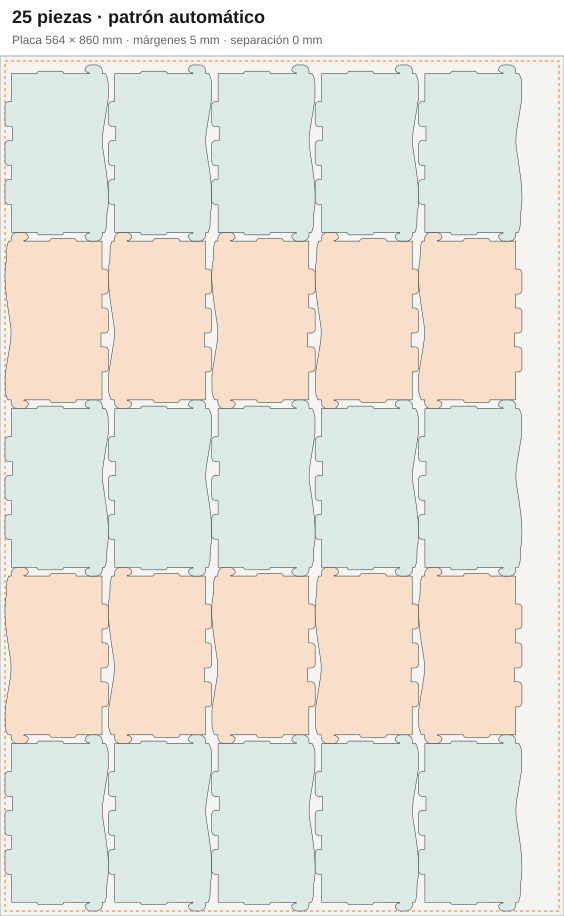

# Exhibidor: 25 piezas por placa

Regresión basada en la disposición manual aportada por el usuario el 6 de
septiembre de 2026. Misma geometría del DXF, sin reducirla, reflejarla ni modificar
su contorno: **103,387 × 176,190 mm**.

## Diferencia con el resultado anterior

Impresión acomodaba cajas envolventes con MaxRects. El láser heredaba esas
posiciones para conservar registro. Aumentar el presupuesto de OpenNest no
mejoraba esta ruta: el layout se había decidido antes, sin usar las concavidades.

El patrón manual alterna filas giradas 180°. Los salientes de una fila ocupan
los entrantes de la siguiente. Cinco filas ocupan aproximadamente 846,1 mm;
cinco columnas, 516,9 mm.

Se conservaron los **5 mm por borde** de la configuración publicada: una placa
de 860 × 564 mm tiene un área útil de **850 × 554 mm**. El área de 856 × 560 mm
mencionada en la conversación correspondería a 2 mm por borde. Las 25 piezas
entran con el margen mayor existente; no fue necesario cambiar la máquina.

| Misma demanda | Antes | Ahora |
| --- | ---: | ---: |
| Capacidad del patrón completo | 24 piezas | 25 piezas |
| 200 piezas (50 unidades comerciales × 4) | 9 placas | 8 placas |
| Escala, margen y separación | 103,387 × 176,190 mm; 5 mm; 0 mm | Iguales |

## Implementación

- Un candidato periódico compara filas y columnas uniformes y alternadas, con
  las orientaciones cardinales permitidas. Se calcula desde los contornos de
  cualquier silueta repetida; no contiene medidas ni identificadores del exhibidor.
- Las bandas del perfil conservan los extremos de cada segmento, sin reducir
  puntos de las curvas. Los huecos se consideran ocupados. Cada fila respeta
  todas las anteriores. Una separación positiva reserva espacio de manera
  conservadora; cero permite contacto pero nunca solapamiento.
- Impresión compara ese candidato con el rectangular por cantidad de placas
  y luego largo total consumido. Se aplica a una silueta, sin paneles ni sangrado
  adicional; otros casos conservan su estrategia existente.
- OpenNest recibe el patrón como una solución inicial que debe conservar si
  sus siguientes intentos no consiguen un resultado mejor. Su presupuesto de
  búsqueda permanece vigente. La política de caché pasó a versión 6.
- Impresión y corte conservan los giros completos: 0°, 90°, 180° y 270°. El
  booleano `rotated` por sí solo no permite distinguir 0° de 180°.
- El validador mantiene la intersección de polígonos y omite el cálculo de
  distancias entre segmentos cuando la separación es cero y no hay una regla
  Common Line que lo requiera.

## Validación

Pruebas del DXF real para 25 y 200 piezas, límites de placa, cantidad, escala,
rotaciones prohibidas, separación positiva, reutilización por el worker y
registro de todos los puntos en impresión y láser. Se conservan además las
regresiones de búsqueda con varias semillas y rechazo de candidatos parciales.

Cotización real comprobada en Chrome y en el resultado de la cola: **200 piezas,
8 placas en ambos procesos, 25 piezas por placa**, sin duplicar el material en
el láser. La diferencia máxima entre las coordenadas de impresión y corte fue
1,14 × 10⁻¹³ mm (precisión numérica). El borrador quedó actualizado; no se emitió OT.

Las 8 placas son el mejor resultado comprobado aquí, no una demostración del
óptimo matemático. Este candidato aún no explora patrones con desplazamientos
entre filas ni mezclas de varias siluetas.
