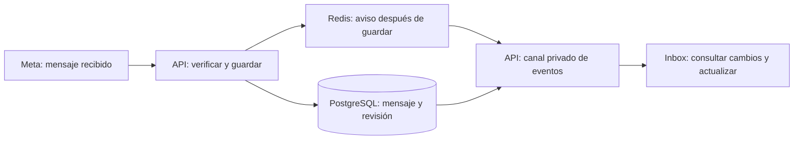

# Inbox en tiempo real

Implementación local del 26/09/2026, rama `codex/inbox-lectura`. Se conecta a la recepción del piloto; todavía no habilita envío, varios contactos, alta por empresa ni historial de coexistencia. No se desplegó en staging.

Commits del bloque: `c2f2dc037` (API y persistencia) y `f8fef7b61` (web y reconexión).

## Explicación simple

Cuando Meta entrega un mensaje, Grafo lo guarda y avisa a las pantallas abiertas. El operador ve el mensaje sin recargar. La base conserva la información; Redis distribuye los avisos entre servidores. Si un aviso se pierde, Grafo vuelve a consultar lo guardado.



La web de venta en Vercel no participa. El Inbox usa la aplicación y API previstas en Fly.io, PostgreSQL en Neon y Redis. Los archivos usarán R2 cuando se implemente su descarga. En local se emplean exclusivamente la API, PostgreSQL y Redis locales.

## Decisiones del protocolo

- Se usa **SSE** para los avisos del servidor al navegador. Las futuras acciones del operador usarán solicitudes HTTP autenticadas. Ambos mecanismos permiten un chat que se actualiza sin recargar; no hace falta contratar otro servicio de chat.
- `InboxCanalRevision` identifica una empresa, una cuenta WhatsApp y un número. La revisión aumenta dentro de la misma transacción que crea los mensajes. Si falla la revisión, se revierte el lote y Meta puede reintentar. Reentregar un mensaje ya guardado no cambia la revisión.
- La fila de revisión serializa los cambios del canal; no se usa un ID global como supuesto orden de commits. Un lote genera un único aviso por canal después del commit.
- Redis Pub/Sub sólo transporta una huella del canal, nunca mensajes, teléfonos ni claves. Cada instancia confirma la revisión contra PostgreSQL. Si el aviso falla, un control cada 15 segundos por **canal activo e instancia** detecta cambios. No se crea una consulta de revisión por pestaña.
- Al abrir o reconectar, `ready` obliga a consultar la página reciente. `cambio` vuelve a consultarla. No hay replay de eventos a partir de `Last-Event-ID`: se recupera el estado persistido. La revisión no es el historial de mensajes.
- Se agrupan avisos durante 250 ms para evitar una consulta por cada mensaje de una ráfaga. La UI serializa sus lecturas automáticas y recuerda avisos que llegan durante una consulta.
- Al perder SSE, el navegador reintenta con espera creciente hasta 15 segundos y conserva una consulta periódica de respaldo. Sin latidos durante más de 45 segundos, el control de respaldo fuerza reconexión. Las pestañas ocultas pausan el canal; al volver consultan otra vez.
- La actualización conserva los mensajes anteriores cargados si la nueva página se solapa con ellos. Si durante una desconexión llegaron más de una página y ya no hay solapamiento, se muestra la ventana reciente y se permite paginar desde allí: no se presenta una conversación con un hueco invisible.
- Leer mensajes anteriores no salta automáticamente al final cuando llega uno nuevo. Si el operador ya estaba cerca del final, sí se acompaña la conversación. Una lectura tiene un plazo de 15 segundos.

El indicador «Actualización en vivo» describe la conexión entre el navegador y Grafo después de una lectura correcta. No certifica la salud de Meta. El respaldo de 15 segundos no es una garantía de entrega de WhatsApp: depende también de Meta, la red y la disponibilidad de la base.

## Acceso y despliegue

`GET /integraciones/meta/inbox/stream` conserva los controles del piloto: administrador, `configuracion.gestionar`, empresa autorizada y capacidad del plan. Empresa y canal se obtienen del servidor. No admite plataforma, impersonación ni MCP.

Además del guard inicial, el canal verifica en la base la sesión, usuario, empresa, membresía, rol, permiso e IP antes de emitir y en cada latido de 15 segundos. Una revocación cierra el canal y retira los datos en pantalla. Las respuestas de otro usuario o empresa también se descartan. Cada conexión dura como máximo cinco minutos y nunca más que el JWT verificado, para renovar la autenticación.

El navegador usa `/api/backend/integraciones/meta/inbox/stream`: el BFF agrega el token desde la cookie httpOnly y transmite el cuerpo sin acumularlo. La respuesta lleva `private, no-store, no-transform`; no debe comprimirse ni almacenarse en caché. La cancelación del navegador se propaga al API y libera la suscripción.

Antes del despliegue agrupado:

1. Aplicar `20260926040000_inbox_revision` con el procedimiento habitual y comprobar permisos del rol de ejecución. No ejecutar seed/reset. Generar Prisma al compilar.
2. API y receptores de webhooks deben compartir PostgreSQL y `REDIS_URL` del mismo entorno. No se agregaron secretos ni proveedores. El tópico es `grafo:inbox:revision:v1`; compartir Redis entre entornos no se recomienda.
3. Desplegar API y web desde la misma versión; respetar el streaming en Fly/proxies. La implementación local no prueba todavía sus timeouts en staging.
4. Con dos pestañas y el contacto autorizado del piloto, comprobar llegada, reconexión, cambio de permisos y cierre. Verificar también un reinicio de API y, antes de producción, carga concurrente y métricas de latencia/errores.
5. Registrar versión, migración y resultado en `deploy/staging/VALIDACION.md`.

## Verificación reproducible

- Pruebas de API: `meta-inbox`, `meta-recepcion` y `webhooks-whatsapp`. Incluyen SSE por socket HTTP con compresión habilitada, datos entregados antes del cierre, liberación de conexión y revocación de acceso.
- Pruebas web: `inbox-tiempo-real`, `inbox-combinar`, `inbox-view`. Incluyen ráfagas, caída/reconexión, cambio de identidad, limpieza, consultas simultáneas, continuidad y posición de lectura.
- `apps/api/scripts/deploy/verify-inbox-tiempo-real.cjs`: ensayo con PostgreSQL y Redis reales, dos instancias de bus, deduplicación concurrente, rollback, otro tenant, aviso omitido, Redis desconectado y recuperación. Exige una base local `*_test` igual a `DEPLOY_DATABASE_NAME`; crea datos sintéticos y borra sólo sus identificadores. No ejecutarlo contra staging/producción.

Ejecutar el ensayo desde `apps/api`, con `DATABASE_URL` de test, `REDIS_URL` local, `DEPLOY_DATABASE_NAME` correcto y `VERIFY_META_SOURCE=true`:

```sh
node -r ts-node/register/transpile-only scripts/deploy/verify-inbox-tiempo-real.cjs
```

Resultado local: 88 pruebas de API y 38 de web aprobadas, más el ensayo con PostgreSQL/Redis reales. TypeScript del código de aplicación de la API, de las dos suites SSE y de la web comprobado; ESLint del alcance y guardia de CSS sin errores. La comprobación global que incluye todos los tests antiguos de la API sigue encontrando errores de tipos en suites ajenas a este cambio (tesorería, cobros, geometría, entre otras); no se presenta esa comprobación global como aprobada. La compilación de producción y la validación del transporte en staging quedan pendientes.

La migración también se aplicó a `gdi_saas` local, sin seed/reset y con permisos del rol de ejecución verificados. Chrome abrió la bienvenida real de `/inbox`; el piloto permanece apagado en esa empresa. La validación de recepción se hizo con datos sintéticos, no enviando mensajes reales.

## Qué sigue

La próxima etapa debe conectar cada empresa con Embedded Signup y resolver su canal de forma única. Después, historial/contacts/echoes de coexistencia, envío y estados de entrega, adjuntos y trabajo del equipo. Cada nuevo cambio persistente del Inbox deberá actualizar la revisión en su misma transacción y avisar tras confirmar. Esas funciones aún no están conectadas a este circuito; no se deben presentar como terminadas por tener SSE.

Referencias del protocolo: [SSE en MDN](https://developer.mozilla.org/en-US/docs/Web/API/Server-sent_events/Using_server-sent_events), [semántica de Redis Pub/Sub](https://redis.io/docs/latest/develop/pubsub/). El diseño evita usar Pub/Sub como almacenamiento porque sus avisos no se conservan durante desconexiones.
