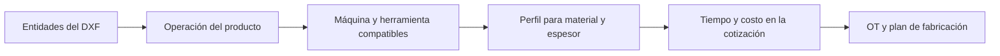

# Mesa de corte, herramientas y cotización — análisis previo a F5

Fecha: 08/09/2026. Base de código: `visual-ilusion/analisis`, commit `706b85381`.

**Estado: diagnóstico y propuesta para discutir; implementación pendiente.** Se revisaron el código, el catálogo local mediante consultas de lectura y documentación oficial de fabricantes. Este trabajo no modifica máquinas, perfiles, cotizaciones ni fórmulas del sistema.

## 1. Resultado y decisión propuesta

Conviene completar una única plantilla **Mesa de corte**, configurable según las capacidades reales de cada equipo. El tamaño no justifica por sí solo dos plantillas: una mesa compacta también puede llevar varias herramientas, y una industrial puede tener distintas configuraciones de cabezal, alimentación y automatización.

La relación **operación → máquina → herramienta → perfil de material/espesor → tiempo y costo estimados** debe resolverse en la cotización. F5 recibe esa configuración técnica y económica, la utiliza para planificar y registra sus revisiones y diferencias de ejecución.

No se conoce el modelo ni el equipamiento de Visual Ilusión. El exhibidor sirve como caso funcional; no demuestra qué máquina tiene la empresa. Tampoco hay una Mesa de corte cargada en el catálogo local consultado. El diseño puede avanzar con configuraciones de referencia; sus valores productivos deberán calibrarse con el equipo real.

## 2. Qué muestran las máquinas reales

| Referencia | Capacidad documentada por el fabricante | Consecuencia para Grafoprint |
| --- | --- | --- |
| Graphtec FCX4000, compacta | Dos portaherramientas en el carro; admite cuchilla, pluma y herramienta de hendido. Áreas útiles de 660 × 488 y 976 × 660 mm. | La configuración pequeña también necesita herramientas y perfiles diferenciados. [Fuente oficial](https://www.graphteccorp.com/cutting/fcx4000/). |
| Summa F Series | Plataforma modular; la página actual describe hasta tres módulos en un flujo y varios tamaños de mesa. | Separar las herramientas disponibles de las posiciones que pueden ocupar. [Fuente oficial](https://www.summa.com/en-int/cutters/flatbed-cutters/f-series). |
| Kongsberg X | Configuraciones ampliables; opciones de fresado y transportador para alimentar placas o rollos. | Alimentación, registro y manejo del material cambian el tiempo además de la velocidad de corte. [Fuente oficial](https://www.kongsbergsystems.com/en/cutting-systems/tables/kongsberg-x). |
| Zünd D3, industrial | Dos puentes, cada uno con hasta tres módulos; el controlador distribuye trabajos entre ambos. | El paralelismo real requiere un modelo propio de ejecución; no se deduce de contar herramientas. [Fuente oficial](https://www.zund.com/en/cutting-systems/digital-cutting-systems/d3-cutter). |

Estas referencias muestran configuraciones posibles, no una característica universal ni una recomendación de compra. Cada modelo y sus opciones instaladas deben declararse.

**Herramientas montadas no equivale a recorridos simultáneos.** Un carro puede seleccionar entre cuchilla y rueda sin un reemplazo manual, pero eso no acredita dos movimientos independientes. La propuesta es estimar secuencialmente por defecto. Los equipos con puentes independientes necesitan una estrategia validada o una estimación del software del fabricante, disponible ya al cotizar; no dividir automáticamente el tiempo por dos o por tres.

También deben distinguirse tres eventos: activar otra herramienta ya montada, reemplazarla manualmente y usar un cambiador automático. La presencia de reconocimiento o calibración automática no demuestra que exista un cambiador automático.

## 3. Operación, módulo, herramienta y perfil

Summa distingue el módulo que acciona el movimiento de la herramienta que procesa el material. Su catálogo incluye cuchillas, herramientas oscilantes, ruedas de hendido, perforación, corte en V y fresas. Esto fundamenta un catálogo de capacidades con campos condicionales. [Módulos y herramientas de Summa](https://www.summa.com/en-int/tools/f-tools).

Una herramienta tampoco equivale a una única operación: Zünd documenta que su KCT puede realizar semicorte y corte completo bajo configuraciones diferentes. Por ello, cambiar de operación puede requerir otro ajuste sin requerir otra herramienta física. [Kiss-Cut Tool KCT](https://www.zund.com/en/cutting-systems/modules-and-tools/kiss-cut-tool-kct).

| Concepto propuesto | Qué declara | Ejemplo ilustrativo |
| --- | --- | --- |
| Máquina | Área útil, límites y capacidades, alimentación, registro, centro de costo. | Mesa de corte de la empresa. |
| Módulo o soporte | Qué herramientas admite una posición; mecanismo de accionamiento cuando corresponda. | Portaherramientas tangencial o módulo de fresado. |
| Herramienta | Identidad, familia, compatibilidad, características y repuesto/desgaste. | Cuchilla oscilante, rueda de hendido, fresa. |
| Operación | Resultado físico requerido por el producto. | Corte completo, corte parcial, hendido. |
| Perfil operativo | Receta de una herramienta para una operación, material, espesor y calidad. | Cuchilla A · corte completo · material X · espesor Y. |

No hace falta administrar el número de serie de cada cuchilla en esta primera entrega. Sí hace falta una referencia estable al tipo de herramienta configurado en la máquina y sus repuestos. Un perfil debe referenciarla, evitando copiar una herramienta entera en cada perfil.

Para una mesa sencilla, módulo/soporte puede quedar resuelto por la configuración inicial. Para una modular, se habilita su edición. Se mantienen las plantillas Láser y Router CNC, reutilizando el contrato de operaciones y estimación donde corresponda. Una mesa con módulo de fresado sigue siendo una sola máquina y un solo recurso de capacidad.

## 4. Situación actual del sistema

| Hallazgo comprobado | Implicación |
| --- | --- |
| Mesa está marcada como provisional en `buildMesaCorteSections`. El título promete perfiles por herramienta/material, pero ofrece nombre, productividad por área, preparación y limpieza. | No permite expresar todavía la receta de cada recorrido. [Plantilla web](../src/lib/maquinaria-templates.ts). |
| La regla específica de perfil para Mesa sólo exige `nombre`; sus claves de detalle son `tipoCorte` y `modoOperacion`. El diagnóstico ejecutado aceptó un perfil activo de corte con nombre, sin velocidad ni herramienta. | La validación específica no acredita que el perfil pueda cotizar recorridos. Hay que completar el contrato y alinear UI/API. [Reglas API](../apps/api/src/maquinaria/maquinaria-template-profile-rules.ts). |
| `troquelado_digital` admite Mesa y T-3, pero no declara magnitud de recorrido, configuración de nesting ni parámetros de operación. | La conexión productiva de Mesa sigue siendo genérica. No alcanza con ampliar el formulario de maquinaria. [Familias](../apps/api/src/productos-servicios/pasos/familias.ts). |
| El selector de capas permite conservar sin operación, corte interior e hendido; el exterior se deriva de la silueta seleccionada. | Faltan operaciones explícitas como corte parcial y la resolución de herramienta/perfil. El nombre `CORTE_PARCIAL` del DXF no basta para costearlo. [Selector](../src/components/productos-servicios/capas-fabricacion-selector.tsx). |
| `piezaHendidoTotalM` se calcula, también para colecciones, pero no se encontró un consumidor de esa magnitud en el cálculo de tiempo. Sólo el corte interior se incorpora al perímetro de corte. | La conservación y medición de hendido no implica que su proceso esté incluido en el costo. [Colecciones](../apps/api/src/motor-universal/geometria-vectorial/geometria-coleccion.ts), [operaciones](../apps/api/src/motor-universal/geometria-vectorial/operaciones-vectoriales.ts), [motor](../apps/api/src/motor-universal/motor.service.ts). |
| El motor resuelve un perfil por paso. Láser tiene selección por operación/material/espesor. CNC tiene campos de operación, material y espesor, pero no participa de esa selección automática por familia. | La base de Láser/CNC es reutilizable, aunque no resuelve varias operaciones de un DXF con perfiles diferentes dentro de una tanda. [Selector por operación](../apps/api/src/motor-universal/seleccion-perfil-operacion.ts). |
| El desgaste actual utiliza primitivas de impresión o volumen de tinta. No hay una relación de herramienta activa con metros/tiempo de mecanizado en ese cálculo. | Debe definirse desgaste por uso de la herramienta, sin cobrar todos los accesorios de la máquina por todo el trabajo. [Motor](../apps/api/src/motor-universal/motor.service.ts), [registro de primitivas](../apps/api/src/motor-universal/primitivas/index.ts). |

La [conservación de capas](dxf-capas-visibles-conservacion-diseno.md) dejó expresamente las nuevas fórmulas y la selección de herramientas para una entrega posterior. Esta auditoría identifica esa conexión pendiente; no invalida la evidencia de conservación/exportación del cierre de F4 ni certifica otra vez todos sus recorridos.

Hay documentación anterior de perfiles y tiempos que describe comportamientos ya cambiados. El contrato definitivo debe reconciliar esos documentos con el código, especialmente las unidades de productividad y los modos automáticos/manuales de Láser/CNC.

## 5. Parámetros que debe contemplar la plantilla

Los siguientes son **campos propuestos**, no valores operativos recomendados para una máquina real.

| Ámbito | Datos básicos | Datos que aparecen según capacidad |
| --- | --- | --- |
| Capacidad de máquina | Ancho/largo útil, restricciones de espesor y material, herramientas disponibles, posiciones compatibles, preparación y limpieza del trabajo. | Puentes independientes, alimentación por transportador/cargador, trabajo por zonas. |
| Manejo y registro | Carga/descarga por placa o tanda; método y tiempo de registro cuando se necesite. | Cámara, cambio de cara, avance del material, calibración adicional. |
| Herramienta | Tipo, soporte compatible, operaciones admitidas, límites, repuesto y criterio de vida útil. | Diámetro de fresa o rueda, ancho/ángulo de herramienta, necesidades de módulo. |
| Perfil operativo | Herramienta, operación, material y espesor, velocidad con unidad explícita, modo de estimación. | Pasadas, profundidad total/por pasada, presión, RPM, parámetros de oscilación, dirección respecto de fibra/canal y calidad. |
| Costeo | Centro de costo existente y uso efectivo de herramienta/consumibles. | Desgaste por metros, horas activas o ciclos según el componente; tiempos de cambios y ajustes. |

La medida total procesable debe respetar la intersección entre máquina, módulo, herramienta, perfil y material. No alcanza con el espesor máximo general de la mesa.

Hay que diferenciar semicorte de vinilo hasta el soporte, corte parcial de una placa y hendido por deformación. No son sinónimos aunque los nombres del archivo sean parecidos. El método de plegado del corrugado del exhibidor se confirma por material y resultado requerido; no se deduce únicamente de la capa `HENDIDO`.

Presión, profundidad o RPM documentan la receta y su compatibilidad. Sólo deben afectar la fórmula si existe una relación definida y calibrada. La velocidad máxima de catálogo no se usará como velocidad efectiva de cotización.

## 6. Conexión de las capas con la cotización



El archivo conserva su geometría y la intención de proceso. La receta del producto declara en qué máquina/proceso se fabrica y sus opciones permitidas. El perfil aporta cómo se realiza sobre ese material. Esta separación permite reutilizar el DXF con otra máquina sin reinterpretar arbitrariamente sus capas.

Reglas necesarias:

- Separar el **rol geométrico** —exterior, interior, referencia— de la **operación física**. Un contorno interior también puede ser corte parcial; una línea abierta puede ser hendido.
- Mantener IDs de fuente y entidad. El nombre y el color sirven para sugerir asociaciones; nunca son la identidad del proceso ni la única regla de agrupación.
- Permitir varias capas para una operación y conservar la posibilidad de clasificar entidades dentro de una capa mixta. Una secuencia intencional sobre el mismo trazo debe declararse, no surgir de una duplicación accidental.
- No añadir tiempo a referencias conservadas sin operación. Si una operación productiva obligatoria no tiene herramienta/perfil válido, explicar qué falta antes de cerrar el precio.
- Resolver automáticamente sólo cuando exista una elección válida según reglas explícitas. Validar también el perfil único, predeterminado o elegido manualmente; ante ambigüedad, pedir una decisión técnica.
- La herramienta puede condicionar separación entre piezas y ancho de corte. Resolver esas restricciones antes de aceptar el nesting; conservar el registro de impresión cuando ya determine el acomodo.
- Congelar en la cotización las asignaciones, parámetros, cantidades y resultados. Una modificación posterior de máquina/perfil no debe cambiar una cotización guardada o una OT emitida silenciosamente.

## 7. Tiempo y costo: una tanda, varias operaciones

Para un recurso que trabaja secuencialmente, la propuesta inicial es:

```text
Tiempo estimado de máquina =
  preparación del trabajo
  + carga, descarga y registro por las placas/tandas previstas
  + suma de tiempos de las operaciones
  + cambios de herramienta y ajustes requeridos
  + limpieza

Costo estimado =
  costo de ocupación del centro de costo
  + desgaste/consumibles aplicables
  + otros conceptos previstos por el modelo de costos existente
```

Cada concepto debe declarar su frecuencia: trabajo, placa, herramienta, operación o pieza. Tres operaciones no justifican cobrar tres veces el mismo material, montaje ni preparación. Los nodos y sus operaciones internas deben conservar una única ocupación de máquina para la tanda y un desglose explicable.

Para recorridos lineales puede usarse longitud × pasadas / velocidad, más entradas, levantamientos y movimientos sin corte cuando estén modelados. Hay dos modalidades que deben distinguirse: velocidad por pasada y velocidad efectiva del proceso completo. Si la segunda ya incluye varias pasadas o maniobras, no se vuelven a multiplicar ni sumar.

La longitud incluye las cantidades por diseño, componente y pedido, sin repetir el exterior como silueta y como entidad de fabricación. Los bordes compartidos sólo descuentan los recorridos físicos elegibles; no descuentan automáticamente hendido, referencia o procesos incompatibles. Debe respetarse la dirección del material cuando altere nesting o productividad.

El redondeo debe aplicarse de forma consistente al resultado agregado: dividir una operación en varias capas no puede encarecerla por redondear cada capa o cobrar un mínimo repetido. El centro de costo tampoco debe volver a incluir un desgaste ya cobrado como consumo específico. Los minutos de máquina y los minutos de trabajo del operario se distinguen cuando la automatización permita solapamientos.

Fresado de cavidades y grabado de superficies no se estiman correctamente con el perímetro exterior solo. Requieren su propia magnitud/modelo o tiempo técnico estimado en el software correspondiente, ingresado y trazado **antes de emitir la cotización**. El DXF conserva recorridos; un archivo de máquina o G-code necesita un postprocesador compatible, que no se presume disponible por conservar las capas.

## 8. Ejemplo para verificar el contrato

Caso didáctico: pedido de diez exhibidores. **Todas las longitudes, velocidades, tiempos y tarifas de este ejemplo son ficticias**, no mediciones del producto actual ni valores para configurar equipos.

| Uso confirmado de entidades | Recorrido del pedido | Perfil ilustrativo | Tiempo de recorrido |
| --- | --- | --- | --- |
| Corte completo | 30 m | Cuchilla A, 3 m/min, una pasada | 10 min |
| Corte parcial | 10 m | Cuchilla A con otro ajuste, 2 m/min, una pasada | 5 min |
| Hendido | 20 m | Herramienta B, 10 m/min, una pasada | 2 min |
| Referencia gráfica | No entra al cálculo | Conservada sin operación | 0 min |

Son 17 minutos de recorrido. Si preparación, manejo de placas, ajustes y limpieza suman otros 15 minutos, la ocupación estimada es 32 minutos. Con un centro de costo ficticio de $12.000/h, ese concepto aporta $6.400; material y desgaste se calculan aparte según corresponda.

Una mesa con ambas herramientas montadas y otra que requiera intercambiarlas pueden usar la misma plantilla. Cambian la compatibilidad y los tiempos de manejo/ajuste. El número de operaciones no es automáticamente el número de reemplazos físicos. Una mesa más pequeña puede necesitar más placas o rechazar una pieza que no entra: eso también cambia el resultado desde la cotización.

## 9. UI y alcance sugerido de la primera entrega

En maquinaria: capacidad y manejo del material, herramientas disponibles y perfiles. Mostrar los campos avanzados al habilitar la capacidad correspondiente; conservar la estética Grafoprint y evitar formularios llenos de opciones inaplicables.

En el producto: **Operaciones sobre las piezas**, con uso, capas/entidades, máquina, herramienta y perfil. En la cotización: desglose resuelto de recorridos, tiempos y costos; el comercial interviene cuando está permitido o falta una decisión, sin configurar todos los parámetros industriales en cada presupuesto.

Secuencia propuesta:

1. **Contrato de operaciones y perfiles.** Acordar semántica de corte completo, parcial e hendido; identidad de herramientas; unidades y bases de cálculo; alcance de compatibilidad y versionado. Revisar su reutilización en Láser y CNC.
2. **Piloto completo de Mesa de corte.** Configurar una mesa de referencia de un puente con varias herramientas y el exhibidor. Conectar importación, receta, selección de perfiles, nesting y costeo, guardado de cotización, OT y exportación. Verificar también una configuración compacta con cambios manuales.
3. **Compatibilidad y cierre.** Comprobar Láser/CNC, snapshots históricos, compuestos y lotes compartidos. Incorporar herramientas y variantes adicionales sólo con una estrategia de estimación definida.
4. **Retomar F5.** Persistencia y revisiones operativas del plan, aprobación/liberación, cola y consolidación entre órdenes, con comparación de estimado y ejecutado.

El primer piloto cubre corte completo, parcial e hendido, placa, registro cuando se requiera y ejecución secuencial. Fresado complejo, alimentación continua y ejecución con varios puentes quedan reconocidos en el modelo, con su estimación técnica explícita cuando sean necesarios; la simulación automática de esas capacidades requiere alcance y validación propios. No se presentarán como modos automáticos ya soportados por haber añadido un campo.

## 10. Comprobaciones de aceptación antes de F5

| Caso | Resultado requerido |
| --- | --- |
| Mismo DXF con corte, parcial, hendido y referencia | Cada entidad conserva pertenencia/rol; cada proceso usa su perfil; referencias sin costo. |
| Pedidos de 1, 10 y 50 unidades, con varias piezas/componentes | Recorridos y cantidades escalan correctamente; preparación según frecuencia, sin duplicación. |
| Cambiar únicamente el perfil de hendido | Cambian su tiempo y sus consumos aplicables; no se sustituye silenciosamente el perfil de corte. |
| Dos perfiles igualmente válidos, ninguno válido o un predeterminado incompatible | Diagnóstico explícito; no obtener un precio final con una operación obligatoria sin resolver. |
| Dos operaciones con una misma cuchilla | No cobrar un reemplazo físico inexistente; sí los ajustes que correspondan. |
| Configuración compacta e industrial secuencial | Una plantilla; dimensiones, herramientas y manejo determinan viabilidad y tiempos. |
| Nesting compartido y bordes comunes | Un consumo de material, una ejecución de la tanda, atribución de costos reconciliada y recorridos elegibles sin repetición. |
| Cambio de velocidades, pasadas, herramienta o material | Caché invalidada cuando corresponda; revisión explícita; cotizaciones históricas preservadas. |
| Cotizar → guardar/reabrir → emitir OT → exportar | Misma fuente/hash, cantidades, capas y configuración técnica congelada; DXF reimportable sin perder información. |
| Láser, CNC y productos sin nuevas operaciones | Mantener comportamiento existente o migración explícita; las capas históricas sin operación no pasan a cobrarse por su nombre. |

Estas son pruebas propuestas, **no resultados obtenidos en esta revisión**. La revisión actual fue de código, consultas de lectura y fuentes de fabricantes; no incluyó pruebas físicas ni una nueva regresión completa.

## 11. Frontera F4/F5 y datos pendientes

El cierre histórico de F4 acredita su alcance probado. La solicitud actual propone una ampliación previa a F5: completar la definición técnica y la estimación de corte en cotización. La mención anterior de herramientas/pasadas/tiempos en F5 debe interpretarse como su uso y revisión operativa sobre una base ya cotizada, no como el primer momento en que se decide el costo.

Si en producción se cambia la máquina, herramienta o agrupación, el plan registra una revisión y su impacto estimado/real. La cotización original conserva lo vendido; una modificación comercial se realiza por el circuito explícito correspondiente.

Para calibrar el piloto de Visual Ilusión faltarán: modelo y área útil, módulos/herramientas realmente disponibles, material y espesor del exhibidor, método de plegado, alimentación/registro y mediciones o tiempos estimados por su software. No se necesita conocerlos para acordar el contrato, pero sí para afirmar que el precio representa el equipo real.
