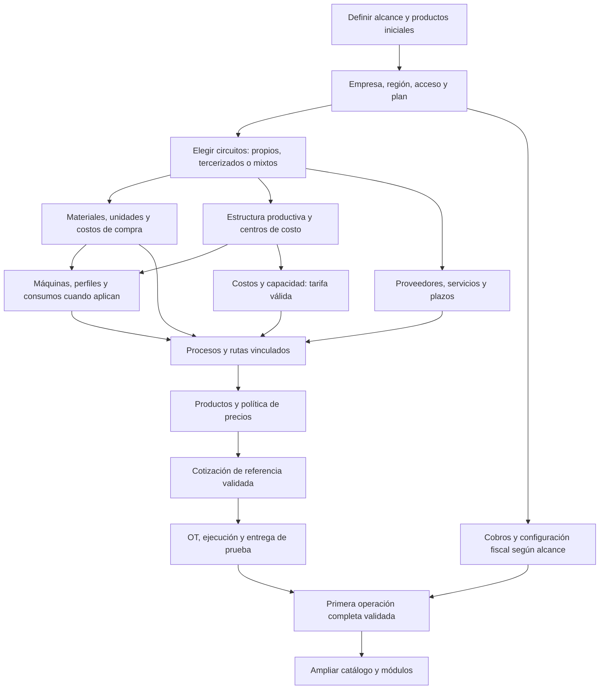

# Onboarding de empresas — De la cuenta vacía a la operación

**Fecha:** 22/09/2026

**Rama:** `codex/onboarding-empresas`, creada desde `main`.

**Estado:** auditoría técnica inicial ejecutada desde empresas vacías: 13 pruebas pasan, con circuitos mínimos digital, gran formato, mixto y tercerizado hasta entrega. Guía interna v0.1 creada; pendiente de validación asistida desde formularios. No equivale a certificar todas las configuraciones o planes.

**Entregables:** [guía del implementador con estética Grafo](onboarding/guia-implementador.html) · [informe de auditoría y cobertura](onboarding/auditoria-2026-09-22.md) · [pruebas reproducibles](../apps/api/src/provisionamiento/onboarding-recorrido.integration.spec.ts).

## 1. Prioridad y conservación de GrafoCommerce

**Ajuste de foco del 22/09/2026:** el usuario prioriza profundizar en una biblioteca de productos con rutas ya configuradas. La guía queda como referencia y no se amplía su interfaz. El próximo trabajo se concentra en ON-03; el diseño específico está en [Biblioteca de productos con rutas](biblioteca-productos-rutas-diseno.md).

Como base de contenido se preparó el [relevamiento de ImprentaOnline.net](investigacion/biblioteca-productos-2026-09-22/README.md), con candidatos comerciales y comparación de categorías. Las rutas se acordarán con Lucas; primero puede ofrecerse una ficha editable como borrador, sin habilitar cotización hasta tener configuración válida.

El usuario priorizó la puesta en marcha de las empresas sobre el desarrollo de add-ons. GrafoCommerce queda conservado en la rama local `codex/grafocommerce`, commit `463c24234`, con estos archivos:

- `docs/grafocommerce-plan-maestro.md`
- `docs/prototipos/grafocommerce-prototipo.html`
- `docs/prototipos/grafocommerce-prototipo.md`

La rama se mantiene separada y sin merge. El commit es local; no se hizo push. Para recuperar la propuesta se puede consultar ese commit o cambiar a esa rama con el trabajo actual guardado. Al retomar habrá que incorporar lo aprendido sobre configuración, recursos y bibliotecas.

## 2. Resultado que buscamos

Una empresa recién creada debe poder preparar una primera familia de productos, cotizar un trabajo con datos propios y ejecutar su recorrido hasta la entrega. El implementador necesita saber qué configurar, por qué, de dónde obtener cada dato y cómo comprobar que quedó bien.

El objetivo inicial será **un primer circuito real validado**, con un alcance acordado. Después se amplía el catálogo y la operación. La empresa no necesita tener implementados todos los módulos para empezar.

Propuesta de hitos independientes:

1. **Acceso preparado:** empresa, responsable, región, contrato y permisos correctos.
2. **Familia cotizable:** recursos, cantidades, costos y precio de venta comprobados para los productos elegidos.
3. **Operación preparada:** OT, responsables, producción o tercerización y entrega probadas.
4. **Administración preparada:** medios de cobro y circuito fiscal que corresponda, con comprobación propia.
5. **Ampliaciones preparadas:** stock, compras, planificación avanzada e integraciones, según alcance.

No equivalen entre sí. Emitir una cotización no demuestra que la facturación esté configurada; tener una máquina cargada no demuestra que su costo sea confiable.

## 3. Hallazgos iniciales verificables

| Hallazgo | Evidencia en código | Consecuencia para el onboarding |
| --- | --- | --- |
| La bienvenida enumera tres primeros pasos, pero el botón de entrada completa el onboarding. | [Bienvenida](../src/components/registro/bienvenida.tsx), [completarOnboarding](../apps/api/src/registro/registro.service.ts). | Separar bienvenida vista de preparación operativa. No usar esa fecha como prueba de implementación terminada. |
| El núcleo de alta crea tenant, roles, datos regionales y suscripción. Las altas de Plataforma nacen con la marca de onboarding completada. | [Provisionamiento](../apps/api/src/provisionamiento/tenant-provisioning.service.ts). | Tanto altas públicas como asistidas necesitan diagnóstico de puesta en marcha. Auditar el resto de los callers para enumerar cualquier configuración adicional. |
| Existen defaults de región y zona horaria en el provisionamiento. | [Provisionamiento](../apps/api/src/provisionamiento/tenant-provisioning.service.ts). | Confirmar la región efectiva del tenant; no asumir que un valor automático describe su operación. |
| Los materiales se pueden instalar desde presets, agregar variantes faltantes o crear copias. | [Biblioteca de materiales](../apps/api/src/inventario/inventario-biblioteca.service.ts). | Reutilizar el mecanismo. Un precio de referencia importado no acredita el precio de compra real de esa empresa. |
| Las máquinas tienen diagnóstico por plantilla, perfiles, canales y consumibles. | [Diagnóstico de maquinaria](../apps/api/src/maquinaria/maquinaria-configuracion.ts). | Convertir los faltantes técnicos en acciones comprensibles y enlazadas al campo correspondiente. |
| Maquinaria valida planta y relaciones; un centro puede crear la planta principal por defecto. | [Maquinaria](../apps/api/src/maquinaria/maquinaria.service.ts), [catálogos de costos](../apps/api/src/costos/costos-catalogo.service.ts). | Revisar el orden y reducir pasos administrativos repetidos. Crear estructura no basta para tener una tarifa utilizable. |
| Las tarifas se recalculan por período; la estructura se distribuye sobre centros productivos y sólo se publican tarifas válidas. | [Tarifas](../apps/api/src/costos/costos-tarifas.service.ts). | Comprobar costo y capacidad del conjunto; evitar duplicar estructura, mano de obra y consumos en distintas partes del modelo. |
| Hay instancias de pasos del tenant creadas desde plantillas del sistema. | [Pasos del tenant](../apps/api/src/productos-servicios/pasos-tenant.service.ts). | Base para bibliotecas de procesos, sin inventar un segundo catálogo de pasos incompatible. |
| La validación de productos distingue rutas, configuración, máquinas, perfiles, consumibles y tercerización. | [Validación de producto](../apps/api/src/productos-servicios/producto-validacion.service.ts). | El checklist debe depender de los pasos activos. Una operación tercerizada puede prescindir de máquina propia y requerir costo y plazo del proveedor. |
| Las recetas publicadas conservan versiones y dependencias. | [Recetas](../apps/api/src/productos-servicios/recetas-producto.service.ts). | La instalación debe producir referencias y versiones válidas, no sólo fichas con nombres. |
| Centro de copiado ya tiene un provisionador de producto/ruta que busca recursos del tenant y declara motivos de omisión. | [Plantilla de Centro de copiado](../apps/api/src/centro-copiado/provisionar-plantilla.ts). | Patrón reutilizable, todavía específico de ese módulo. Auditar las selecciones automáticas antes de generalizarlas a paquetes instalables. |
| Previsión de materiales combina stock, reservas, compras y plazos de proveedores. | [Previsión](../apps/api/src/inventario/prevision-materiales.service.ts). | Costear material y controlar existencia son preparaciones distintas. No presentar una fecha confiable sin verificar las fuentes que la sostienen. |
| Las capacidades del plan y los permisos condicionan las altas y configuraciones. | [Capacidades](../apps/api/src/suscripciones/capacidades-empresa.service.ts), [catálogos por plan](planes-catalogos-maestros-2026-09-21.md). | Distinguir dato faltante, permiso insuficiente, función fuera del plan y función que no aplica. |

Estos hallazgos provienen de lectura estática. No se creó una empresa ni se modificaron datos para este relevamiento. La presencia de un servicio o de tests previos no reemplaza la prueba de alta desde cero.

## 4. Flujo padre propuesto

El recorrido visible empieza por **qué vende y cómo trabaja la empresa**. Con esas respuestas, Grafo puede ordenar las dependencias que hay que resolver. El mapa técnico tiene tareas paralelas y variantes; no es una cadena rígida igual para todos.

El diagrama expresa una propuesta operativa. No implica que todos los productos necesiten todos los nodos. Un proceso manual no obliga a crear una máquina; una ruta tercerizada no obliga a modelar la maquinaria del proveedor.

### Orden de trabajo para el implementador

| Paso | Qué se resuelve | Dato o evidencia de salida |
| --- | --- | --- |
| 0. Alcance | Qué vende, qué produce, qué terceriza y cuáles serán los primeros trabajos. | Lista corta de productos reales y una muestra de cotizaciones anteriores. |
| 1. Base de empresa | País, moneda, zona horaria, datos comerciales, responsable y funciones contratadas. | Acceso y permisos comprobados; decisiones regionales confirmadas. |
| 2. Estructura | Plantas necesarias, sectores y centros productivos o de estructura. | Recursos organizados sin exigir complejidad que la empresa no tiene. |
| 3. Insumos y proveedores | Variantes, formatos, unidades de compra/uso, equivalencias, costos, monedas y vigencia; tercerizados aplicables. | Por ejemplo, una compra por litro convertida correctamente a costo por ml, con fuente identificada. |
| 4. Producción propia | Máquinas, área útil, perfiles, productividad, preparación, consumibles y desgaste aplicables. | Diagnóstico técnico resuelto para los perfiles elegidos; datos confirmados por la empresa. |
| 5. Costos de operación | Gastos, personal/costos de mano de obra, capacidad práctica y reparto. | Tarifa utilizable del período; revisión de omisiones y doble cómputo. |
| 6. Procesos y rutas | Secuencia, recursos, reglas de cantidad, tiempos, materiales y operaciones tercerizadas. | Ruta resoluble con dependencias y versión coherentes. |
| 7. Productos y precios | Especificaciones, opciones comerciales, rutas y regla de venta, impuestos/comisiones aplicables. | Producto validado; margen y precio explicables. |
| 8. Primera cotización | Comparar contra un trabajo conocido. Revisar consumos, aprovechamiento, tiempos, costos y venta. | Diferencias justificadas con datos del tenant, no sólo ausencia de errores. |
| 9. Primera operación | Cliente, emisión, asignación/ejecución, entrega y cobro; facturación si forma parte del alcance. | Una prueba completa con responsables y evidencia. |
| 10. Ampliación | Más productos, stock/compras, planificación, fiscalidad adicional e integraciones. | Cada ampliación obtiene su propia validación. |

Materiales/proveedores y estructura pueden prepararse en paralelo. Los datos financieros que alimentan costos pueden relevarse mientras se cargan las máquinas. El personal que opera, su usuario de acceso y su costo laboral son conceptos distintos.

### Variantes que hay que demostrar

- **Centro de copiado / digital:** papeles, tóner/click según modelo, impresora, perfiles de impresión, terminaciones y cotización por documento.
- **Gran formato:** rollos/placas, tintas, formatos y conversiones, perfiles y consumos por área, terminaciones y aprovechamiento.
- **Tercerizador:** proveedores, fuente de costo y plazos; sin exigir maquinaria propia para operaciones contratadas.
- **Operación mixta o industrial:** varios recursos y rutas alternativas, centros, calendarios y asignaciones según capacidad.
- **Empresa ya configurada parcialmente:** reutilizar lo válido y diagnosticar faltantes; no reinstalar encima de su trabajo.

## 5. Qué es imprescindible y qué puede incorporarse después

La clasificación se hará por **objetivo y familia de productos**, no sólo por módulo.

- Para cotizar con costos confiables son necesarias las fuentes efectivas que use la receta. No se debe inventar stock para instalar un material ni inventar un costo cero para completar un paso.
- Tener datos de materiales no implica usar movimientos de stock. El control de existencia se activa y valida como circuito propio cuando corresponda.
- Si se promete una fecha basada en capacidad o reposición, calendarios, disponibilidad y plazos relevantes dejan de ser opcionales para esa promesa.
- ARCA, impresión QZ y otras integraciones tienen condiciones y alcance propios. No deberían bloquear un objetivo que no las utiliza.
- Un dato estimado puede servir en una evaluación acompañada, pero debe identificarse y tener responsable/fecha de confirmación. No se mostrará como validado por venir de una plantilla.
- Un producto incompleto no debe impedir preparar otro circuito que sí tenga todos sus datos.

## 6. Bibliotecas instalables: propuesta de funcionamiento

### Desde la mirada de la empresa

«Quiero empezar a vender tarjetas y flyers» debería llevar a elegir un paquete de **Impresión digital**, revisar qué incluye y conectar sus requisitos con los recursos de esa empresa.

Ejemplo de resolución guiada:

1. Estas plantillas necesitan impresión, corte y dos tipos de papel.
2. La empresa elige qué máquina imprime y qué recurso corta, o indica tercerización.
3. Grafo ofrece vincular materiales existentes o instalar los que faltan.
4. Se confirman precios de compra, unidades, productividad y política comercial propios.
5. Se instalan las rutas y productos con esas referencias.
6. Se ejecuta una cotización de referencia y se habilita el circuito validado.

### Capas reutilizables

| Biblioteca | Qué puede aportar | Qué debe decidir o confirmar cada tenant |
| --- | --- | --- |
| Materiales | Identidad técnica, variantes, unidades y formatos. | Proveedor, presentación real, precio, moneda y vigencia; existencia si se controla stock. |
| Máquinas/perfiles | Estructura por tecnología y campos requeridos; valores de referencia identificados. | Equipo real, capacidades, productividad y consumibles/costos efectivos. |
| Procesos | Tipo de operación, entradas, salidas y campos. | Recurso, tiempos, condiciones y alternativa tercerizada. |
| Rutas | Secuencia y dependencias de operaciones. | Vinculación a procesos y recursos compatibles del tenant. |
| Productos | Configurador, especificaciones, rutas sugeridas y contenido comercial. | Variantes ofrecidas, restricciones y política de precios. |
| Paquetes | Conjunto compatible de lo anterior para un circuito. | Alcance que instalar, recursos a reutilizar y datos locales pendientes. |

### Condiciones técnicas para que la instalación sea segura y repetible

- Manifiesto con identificador, versión, dependencias, capacidades requeridas y referencias lógicas; no IDs de otra empresa.
- Vista previa de qué se creará, qué se vinculará y qué datos faltan. Resolver ambigüedades; no elegir arbitrariamente la primera máquina o material compatible.
- Comprobación de dependencias, unidades y ciclos antes de aplicar cambios.
- Registro de instalación y correspondencia entre plantilla y recurso local; reintentar sin duplicar.
- Instalación transaccional cuando sea viable; si requiere varias fases, recuperación e informe claro de lo pendiente.
- Actualizaciones versionadas con diferencias y respeto por ajustes locales. Una mejora en la biblioteca no sobrescribe precios o recetas de clientes automáticamente.
- Reversión limitada por el uso: un recurso referenciado por OTs históricas requiere conservar trazabilidad y, cuando corresponda, desactivarse en lugar de borrarse.
- Estados distintos: **instalado → vinculado → datos confirmados → cotización validada → circuito operativo**.

El instalador general es una propuesta. La biblioteca de materiales y el provisionador de Centro de copiado son antecedentes concretos; todavía no se comprobó un instalador transversal de productos/rutas listo para este objetivo.

## 7. Onboarding guiado: comportamiento esperado

Propuesta para diseñar después de validar el mapa:

- Empezar con preguntas sobre la operación: qué vende, qué fabrica y qué terceriza.
- Mostrar la siguiente acción que destraba su primer objetivo, con la razón y el dato que debe conseguir.
- Permitir empezar con un circuito pequeño, guardar avance y continuar en otra sesión.
- Aprovechar formularios y validadores actuales; evitar un segundo sistema de reglas que contradiga al motor.
- Abrir directamente la sección que contiene el faltante y revalidar al guardar.
- Reconocer datos ya cargados, capacidades contratadas y permisos del usuario.
- Compartir tareas entre implementador y responsables del tenant, sin exigir que todos vean costos o datos privados.
- Derivar avance de comprobaciones reales. Las tareas humanas pueden requerir confirmación explícita y evidencia, claramente diferenciadas de una validación técnica.
- Volver a marcar un problema si se elimina un recurso o vence/cambia un dato esencial después de completar el recorrido.

Ejemplo de mensaje: **«Para cotizar tus lonas falta el precio de la tinta negra por ml. Lo usamos para calcular el costo de impresión. Completar en la HP…»**. El nombre y destino deben venir de la configuración real, no de un texto fijo.

## 8. Guía interna del implementador

Se propone una guía navegable con estética Grafo y versión imprimible cuando el flujo esté validado. Este Markdown conserva el razonamiento inicial; no reemplaza todavía ese entregable visual.

Cada etapa de la guía tendrá:

1. Objetivo y a quién aplica.
2. Requisitos previos y tareas que pueden hacerse en paralelo.
3. Datos/documentos a pedir y responsable de aportarlos.
4. Recorrido exacto por Grafo, con enlaces y capturas vigentes.
5. Ejemplo de una gráfica pequeña y una operación más compleja cuando difieran.
6. Prueba de salida y evidencia que guardar.
7. Errores frecuentes, cómo resolverlos y cuándo escalar.
8. Qué automatizará una biblioteca y qué debe confirmar la empresa.

La guía, los paquetes instalables y el asistente deberán compartir las mismas definiciones de requisitos para reducir divergencias. El mecanismo concreto para mantenerlas sincronizadas se diseñará durante la implementación.

## 9. Próximas etapas y evidencia pendiente

| Etapa | Entregable | Criterio de cierre | Estado |
| --- | --- | --- | --- |
| ON-00 | Preservación de Commerce y rama propia. | Commit de referencia recuperable y trabajo de onboarding separado. | Completada localmente. |
| ON-01 | Auditoría desde tenant vacío y mapa de dependencias. | Recorridos propios, tercerizados y mixtos probados; inventario de defaults, bloqueos, vínculos e importadores. | Primera matriz técnica: 13 pruebas pasan. Falta validar formularios, contratos comerciales, ampliaciones e importadores. |
| ON-02 | Guía interna con estética Grafo. | Un implementador puede reproducir al menos los circuitos validados sin conocimiento tácito del creador. | v0.1 lista: cuatro recorridos, diez etapas, criterios de salida y acta. Falta piloto asistido para certificar el recorrido desde UI. |
| ON-03 | Modelo de bibliotecas y primer paquete. | Instalación, vinculación y reintento probados sin duplicar ni sobrescribir configuración local; procedencia versionada para futuras actualizaciones revisadas. | Prioridad actual. Análisis de portabilidad y propuesta de piloto documentados; implementación pendiente. |
| ON-04 | Asistente de puesta en marcha. | Detecta faltantes reales, adapta pasos y conserva/revalida avance; llega a una primera operación validada. | Pendiente. |
| ON-05 | Piloto acompañado y ajustes. | Una empresa nueva completa el circuito y sus dificultades alimentan la guía y el producto. | Pendiente. |

En ON-01 ya se comprobó el núcleo del alta, región explícita, vacíos iniciales, reinstalación de materiales, conversiones, publicación de tarifa, diagnóstico de máquina al crearla y cuatro circuitos mínimos hasta entrega. Se usaron catálogos globales para probar biblioteca/copias; no se copió el catálogo de otro tenant. Falta validar formularios, calendarios/capacidad, cobros/factura, reservas/compras y contratos/permisos comerciales. Se identificó importación de proveedores; falta relevar la cobertura completa de importadores.

**Próximo incremento propuesto, ajustado al foco del usuario:** contrato portable y primer producto con ruta configurada, seguido de resolución de recursos locales e instalación. Reutilizar los diagnósticos existentes dentro de este flujo. El asistente general y nuevas interfaces de onboarding quedan para una etapa posterior. Ver [alcance y criterios del piloto de biblioteca](biblioteca-productos-rutas-diseno.md#5-piloto-propuesto-tarjetas-y-luego-flyers).

Usar entornos y empresas de prueba aislados. Los datos de la empresa existente no acreditan una instalación desde cero. Registrar pasos, bloqueos, tiempo activo y tiempo esperando datos; estos últimos pueden ser el principal cuello de botella del onboarding.

## 10. Registro de decisiones

| Fecha | Decisión o hallazgo | Estado |
| --- | --- | --- |
| 22/09/2026 | Priorizar onboarding y conservar GrafoCommerce para más adelante. | Indicación del usuario; Commerce guardado en commit local. |
| 22/09/2026 | La marca actual de onboarding acredita la entrada tras la bienvenida, no preparación operativa. | Verificado en código y ejecución; no modificado. |
| 22/09/2026 | Organizar el recorrido por objetivo y operaciones propias/tercerizadas; bibliotecas con vínculos a recursos locales. | Cuatro circuitos técnicos mínimos validados; contratos, variantes y formularios pendientes. |
| 22/09/2026 | La biblioteca instala variantes sin declarar la unidad del precio; reinstalar faltantes conserva el precio local. | Comprobado en PostgreSQL de pruebas. Requiere confirmación guiada de datos económicos. |
| 22/09/2026 | Publicar guía v0.1 con cobertura y límites explícitos. | Artefacto HTML local; no agrega todavía un asistente dentro de Grafo. |
| 22/09/2026 | Centrar el siguiente trabajo en productos con rutas preconfiguradas; mantener centros/costos propios y reutilizar biblioteca de materiales. | Indicación del usuario. Análisis específico documentado; piloto propuesto, sin instalación todavía. |

**Cambios de esta etapa:** documentación, guía interactiva y pruebas de integración. No se modificó código de producción ni datos de tenants existentes. Las escrituras de la auditoría se realizaron en la base de tests y se revirtieron. GrafoCommerce permanece en su rama local preservada.
