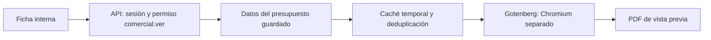

# Piloto PDF de presupuestos — 17/09/2026

> Registro de la prueba inicial. La implementación vigente, activación y operación están en [PDFs de presupuestos: generación y operación](pdf-presupuestos-produccion.md). La ficha ya utiliza una única acción PDF; el endpoint piloto sigue disponible sólo con su flag interno.

## Resultado y alcance

Se agrega **PDF piloto** junto al PDF habitual en la ficha interna del presupuesto. Usa HTML/CSS de impresión y Chromium en un contenedor Gotenberg independiente. Comparte `PresupuestoPdfDatos` con jsPDF: importes, cantidades, descuentos y moneda salen de la misma proyección del presupuesto guardado.

El piloto sirve para validar diseño y render. No reemplaza el archivo emitido, no publica otro enlace al cliente ni usa `Archivos.materializar`. La emisión, los envíos y las descargas habituales siguen usando jsPDF y el almacenamiento existente. Sin migraciones de base ni nuevas dependencias npm.

La propuesta visual usa Geist, grafito, acentos naranja, logo/contactos del tenant, especificaciones legibles, total destacado y pie con referencia/numeración. Es texto seleccionable. A4, encabezado de tabla repetido, filas normales completas y división permitida para un producto cuya descripción ocupa varias páginas. El cierre mantiene total, condiciones y observaciones juntos cuando caben en una página.

## Cómo probar

Desde la raíz:

```sh
docker compose --profile pdf up -d pdf-renderer
```

En `apps/api/.env` y reiniciar la API:

```dotenv
PRESUPUESTO_PDF_PILOTO=true
PDF_RENDER_URL=http://127.0.0.1:3002
```

Abrir **Comercial → Presupuestos → un presupuesto → PDF piloto**. El botón **PDF** permite comparar con el archivo emitido. El flag está desactivado por defecto en `.env.example`; desactivarlo oculta el botón y devuelve 404 en el endpoint piloto. El entorno local de esta prueba quedó habilitado.

## Implementación



- `GET /presupuestos/:id/pdf-piloto` conserva la sesión, permiso y aislamiento por tenant del módulo. Primero obtiene un presupuesto autorizado; luego consulta la caché. El BFF propaga `Cache-Control: private, no-store`.
- Caché **por proceso**, clave SHA-256 de tenant, presupuesto, versión de plantilla y datos completos (incluye logo). TTL 5 minutos; máximo 16 documentos y 32 MiB. El TTL se depura al recibir pedidos. Pedidos iguales simultáneos comparten una promesa; un fallo permite reintentar.
- Máximo 8 renders distintos pendientes en cada API. Gotenberg tiene 2 conversiones concurrentes y cola máxima de 8. Exceso: 503 recuperable. No es una cola durable ni distribuye cupos entre tenants.
- Límite piloto: 500 productos, 4 MiB de entrada JSON y 16 MiB de salida. La API aborta a los 35 segundos; Gotenberg mantiene su timeout de 30 segundos.
- HTML escapado, fuentes adjuntas y logo como imagen `data:`. No hay navegación a sitios del tenant. JavaScript, tráfico público/privado, descarga remota, webhooks y rutas de LibreOffice/PDF engines deshabilitados en el contenedor de desarrollo.
- Gotenberg **8.37.0**, imagen fijada por digest en Compose. Puerto local `127.0.0.1:3002`, límite 2 CPU / 1 GiB. Chromium no se incorpora al proceso ni a la imagen de Nest.
- La plantilla y el adaptador están en `apps/api/src/presupuestos/pdf-piloto/`; `VERSION_PRESUPUESTO_HTML` identifica esta revisión. Al llevarlo a producción, el renderer debe permanecer en una red privada con autenticación/red apropiadas al despliegue.

## Medición local

Mismo presupuesto de un producto, mismo logo y contactos reales, mismo JSON de entrada para ambos motores. Mac arm64, Node 23.11.0, Gotenberg preiniciado; otros servicios de desarrollo activos. Sin caché salvo el escenario identificado. Valores de la última ejecución tras ajustar la paginación:

| Escenario | Pedidos | Concurrencia solicitada | Mediana | P95 |
| --- | ---: | ---: | ---: | ---: |
| jsPDF · 1 producto | 20 | 1 | 130 ms | 138 ms |
| HTML · 1 producto | 20 | 1 | 135 ms | 210 ms |
| HTML · ráfaga de presupuestos cortos | 20 | 4 (2 slots de render) | 570 ms | 776 ms |
| jsPDF · 24 productos | 5 | 1 | 134 ms | 171 ms |
| HTML · 24 productos | 5 | 1 | 158 ms | 279 ms |
| HTML · caché caliente, llamada en proceso | 20 | 4 | 2 ms | 2 ms |

**90 solicitudes medidas, 0 errores.** Archivos cortos: jsPDF **49.633 bytes**, HTML **58.748 bytes**. Memoria del contenedor al finalizar: **486,6 MiB**; pico acumulado desde su arranque: **613,7 MiB**, incluye Gotenberg, Chromium y caché de páginas del sistema operativo. No es la memoria por PDF ni una comparación de RAM contra jsPDF.

Los tiempos cubren el render/HTTP local, no la consulta a la base, subida a storage, proxy o descarga del navegador. Caché medida en proceso, sin HTTP. La muestra larga tiene sólo cinco mediciones; no caracteriza una carga sostenida. El mismo contenido de 24 productos ocupa 3 páginas en el diseño compacto de jsPDF y 6 en la propuesta HTML, que muestra cada especificación por separado: se comparan documentos con el mismo contenido, no diseños idénticos. Estas cifras no demuestran capacidad para miles de PDFs concurrentes. Datos completos: `docs/benchmarks/pdf-presupuesto-piloto-2026-09-17.json`.

Reproducción, desde `apps/api`, con un JSON que respete `PresupuestoPdfDatos`:

```sh
PDF_RENDER_URL=http://127.0.0.1:3002 npx ts-node --transpile-only scripts/benchmark-pdf-piloto.ts /ruta/datos.json
```

El script no consulta ni modifica base/storage. Escribe la comparación en `output/pdf`, y ejemplos sintéticos de paginación/mediciones en `tmp/pdfs`; ambos directorios están ignorados por Git. No versionar JSON de entrada con datos de clientes/logos.

## Validación

- Generación real y revisión visual de presupuesto de una página con logo y datos regionales.
- 24 productos: 6 páginas, todos los productos presentes, encabezados repetidos y cierre completo.
- Un producto con 65 especificaciones: 3 páginas, sin perder texto ni dejar una primera página vacía por la altura de la fila.
- Caso sin logo: iniciales. Importes ARS/USD y moneda sin decimales cubiertos por tests.
- Texto extraído con pdfplumber para comprobar contenido y numeración; revisión de PNG con Poppler para verificar cortes y espaciado.
- Tests de escape, caché aislada, deduplicación, expiración, límites, reintentos y respuestas inválidas del renderer. Regresión de presupuestos y acción de interfaz.
- Apertura desde la ficha en Chrome; endpoint sin sesión devuelve 401. Durante la captura de comparación se verificó que los registros de archivos emitidos mantuvieran id, key, bytes y fecha de actualización.

## Decisión para la siguiente etapa

El piloto permite avanzar con HTML/CSS por la flexibilidad de diseño y paginación. Antes de convertirlo en el generador habitual del SaaS:

1. Aprobar el diseño con presupuestos representativos, varias monedas, descuentos y condiciones reales de los tenants.
2. Capturar una entrada inmutable al emitir (incluidos branding, condiciones, moneda y versión de plantilla/fuentes). Los importes ya salen del presupuesto guardado; esta vista previa sigue leyendo la configuración actual del negocio.
3. Integrar una cola **durable** BullMQ y un worker de documentos separado, con reintentos acotados, idempotencia, cuotas por tenant y métricas de espera/errores/CPU/RAM.
4. Persistir cada versión final en object storage con registro/cuota y servir su URL firmada. Descargar un documento emitido debe reutilizar el mismo archivo, como ocurre hoy.
5. Hacer una prueba sostenida con mezcla real de tamaños y picos de tenants; dimensionar workers con esos resultados y activar gradualmente. Conservar los PDF históricos emitidos.
